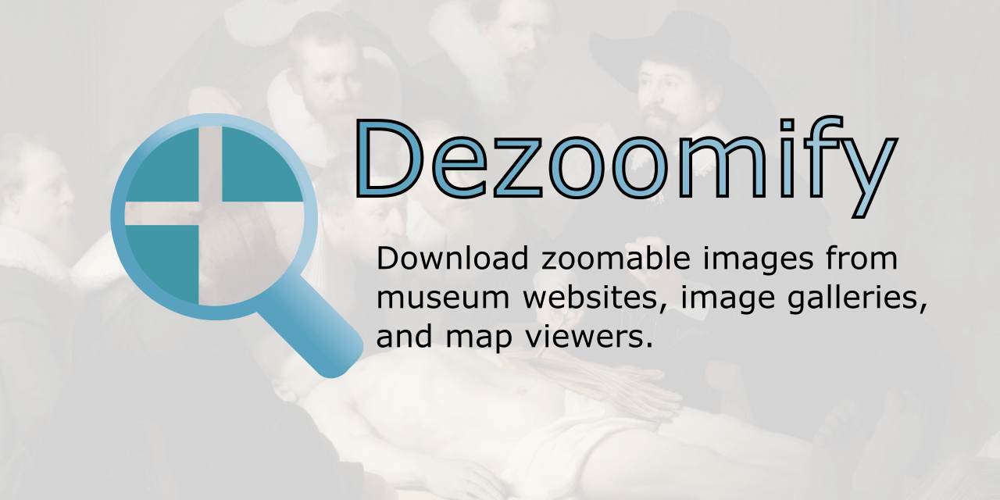

# Dezoomify

## Download zoomable images

images make our works looks facinating ..one of the best is zoomify images.
_Dezoomify_ extracts full high-resolution images from online zoomable image interfaces.
It works with several zoomable image tools, from several different websites (see the list below).
It takes as input the URL of a a zoomable image and gives as output an image that you can download (by right-clicking on it, and choosing *Save Image as...*).

In order to find the URL of the zoomable that dezoomify requires, you can install the [**dezoomify browser extension**](https://github.com/lovasoa/dezoomify-extension/#dezoomify-extension). Alternatively, you can also try to [find the zoomable image URL yourself](https://github.com/lovasoa/dezoomify/wiki/Dezoomify-FAQ).

## Try it
If you are not interested in the source code and just want to assemble tiles of (dezoomify) a zoomify-powered image, go there : [**unzoomify an image**](https://ophir.alwaysdata.net/dezoomify/dezoomify.html)

## Troubleshooting
#### FAQ
If you have problems while downloading an image, then read the **[FAQ](https://github.com/lovasoa/dezoomify/wiki/Dezoomify-FAQ)**.
#### Reporting issues
Your bug reports and feature requests are welcome!
Please go the the [Github issue page of the project](https://github.com/lovasoa/dezoomify/issues),
and explain your problem.
Please be clear, and give the URL of the page containing the image dezoomify
failed to process.

## Supported zoomable image formats
The following formats are supported by dezoomify:
 * [Zoomify](http://www.zoomify.com/) : Most common zoomable image format. *dezoomify* used to support only this, hence the name.
 * [Deep Zoom](http://en.wikipedia.org/wiki/Deep_Zoom) : Zoomable image format created by Microsoft. Dezoomify has a special support for the following websites that use *Deep Zoom*:
   * The [British Library](http://www.bl.uk/)
   * [National Gallery](http://www.nationalgallery.org.uk/) : The national gallery uses its own zoomable image format.
   * The [World Digital Library (WDL)](http://www.wdl.org/fr/)
   * [Polona](http://polona.pl/), the Polish Digital National Library
   * [BALaT](http://balat.kikirpa.be/), Belgian Art Links and Tools
 * [Arts & Culture](https://artsandculture.google.com/) (formerly Google Art Project): a cooperation between google and several international museums. [More info about the controversy around this dezoomer.](https://github.com/lovasoa/dezoomify/issues/435).
 * [IIIF](https://iiif.io): The International Image Interoperability Framework, used on many websites, including:
   * [Gallica](https://gallica.bnf.fr/), the numeric library of the French national library
   * [Bavarikon](https://www.bavarikon.de/)
   * [Harvard's library](https://library.harvard.edu/)
 * [Zoomify single-file format](https://github.com/lovasoa/pff-extract/wiki/Zoomify-PFF-file-format-documentation) : Less common format used by zoomify, where all tiles are in a single *.pff* file, and are queried through a java servlet.
 * [XLimage](http://www.centrica.it/products/xlimage-2/), a zoomable image format developed by an Italian company. It is used on the following websites:
  * The [Royal Library of Belgium](http://kbr.be/)
 * **TopViewer**, also named **Memorix Maior picture viewer** used on the following websites:
   * [daguerreobase](http://daguerreobase.org/en/), a collection of daguerreotypes.
   * [Several dutch websites](https://picturae.com/nl/website/websites-portfolio) developed by the company picturae.
 * [krpano Panorama Viewer](http://krpano.com), mainly used in panoramic images and interactive virtual tours.
 * [The Tretiakov gallery](http://www.tretyakovgallery.ru/en/), official website of the Третьяковская галерея (in Moscow).
 * [FSI Viewer](https://www.neptunelabs.com/products/fsi-viewer/), zoomable image server by NeptuneLabs GmbH.
 * [Visual Library Server](https://www.semantics.de/visual_library/), by semantics
 * [Micr.io](https://micr.io/)'s non-IIIF format, used on [vangoghmuseum.nl](https://www.vangoghmuseum.nl/en/explore-the-collection)
 * [Hungaricana](https://hungaricana.hu/en/) a format found only on the **Hungarian Cultural Heritage Portal**, that hosts half a million images.

The most prominant supported websites include :
- Arts & Culture (artsandculture.google.com)
- Gallica (gallica.bnf.fr)
- The British Library (bl.uk)
- National Gallery of Art (nga.gov)
- Hungaricana (hungaricana.hu)
- National Library of Australia (nla.gov.au)
- National Library of Israel (nli.org.il)
- National Galleries Of Scotland (nationalgalleries.org)
- National Library of Scotland (nls.uk)
- Harvard Library (library.harvard.edu)
- heidICON, Heidelberg University (heidicon.ub.uni-heidelberg.de)
- Geographicus (geographicus.com)
- Archivio di Stato di Trieste (archiviodistatotrieste.it)

Dezoomify also has a
[generic dezoomer](https://github.com/lovasoa/dezoomify/wiki/Generic-dezoomer-tutorial).
If the zoomable image format is simple enough, you just have to enter a pattern of tile
URL, and dezoomify will be able to work with it.

## Screenshots

## Video tutorial

# Programming Languages
The aim of the script is to do as much as possible in _Javascript_ (with the HTML5 `<canvas>` tag), and only the network-related stuffs on the server side. The only little piece of server-side code that remains in the code is just a proxy, used to circumvent the [same-origin policy](https://developer.mozilla.org/en-US/docs/Web/Security/Same-origin_policy).
We implemented this code both in Javascript ([node-app/proxy.js](node-app/proxy.js)) and PHP ([proxy.php](proxy.php)), so you just need to have either one
on your server to run dezoomify.

## Wikimedia
This script on wikimedia : [Zoomify in the help about zoomable Images on wikimedia](https://secure.wikimedia.org/wikipedia/commons/wiki/Help:Zoomable_images)

## GPL
> Copyright © 2011-2017 Lovasoa
>
>  This file is part of Dezoomify.
>
>  Dezoomify is free software; you can redistribute it and/or modify
>  it under the terms of the GNU General Public License as published by
>  the Free Software Foundation; either version 2 of the License, or
>  (at your option) any later version.
>
>  Dezoomify is distributed in the hope that it will be useful,
>  but WITHOUT ANY WARRANTY; without even the implied warranty of
>  MERCHANTABILITY or FITNESS FOR A PARTICULAR PURPOSE.  See the
>  GNU General Public License for more details.
>
>  You should have received a copy of the GNU General Public License
>  along with Dezoomify; if not, write to the Free Software
>  Foundation, Inc., 51 Franklin St, Fifth Floor, Boston, MA  02110-1301
>  USA*/
