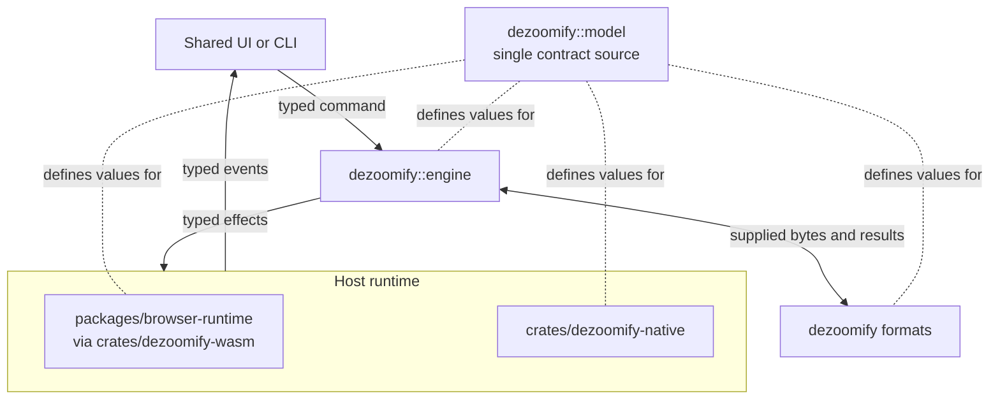
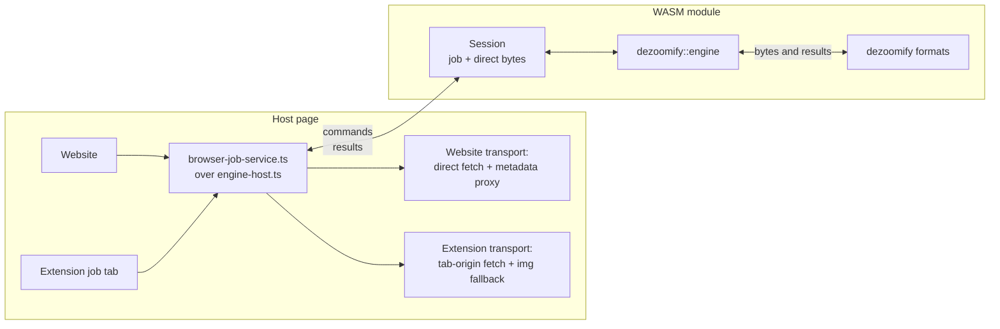
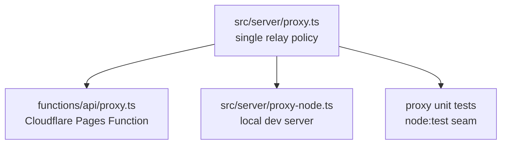

# Architecture

dezoomify is one monorepo containing Rust crates, generated WASM bindings, the shared UI, browser-extension packaging, and native applications. Dependencies point inward toward pure domain libraries; hosts own all effects.

## Components

### `crates/dezoomify`

The single pure Rust domain crate. `model` defines canonical public values;
format modules turn supplied bytes and URLs into catalogs, tile plans, and
processing recipes; `engine` owns job lifecycle policy. It never fetches
anything and touches no network, filesystem, clock, UI, or codecs. Formats
register in one ordered registry; registry order sets automatic precedence.
Catalog construction owns canonical level ordering, which freezes before
publication; selection uses array positions. Formats compile conventional ready
images through `ImagePlan`, which rejects images lacking both levels and warnings
and tile counts beyond the engine's ordinal range before assigning the format
identity. Grid, positioned,
generic-template, adaptive, and format-owned tile sources implement one
crate-private tile-program contract, including declared geometry and stable
source-kind metadata; the public source variants remain a compatibility facade, and the
engine starts work without dispatching on those variants.
Discovery handlers follow extracted references through `DiscoveryResource`,
which resolves them against the post-redirect URI before issuing the next pure
request.

#### `dezoomify::engine`

Pure state machine: owns discovery, selection, planning, acquisition, recovery choices, and finalization. Hosts send typed commands and carry out the effects it emits. It keeps no routing identifiers; integrations keep opaque job tokens outside it. See [Job engine](job-engine.md).

#### `dezoomify::model`

The single source of truth for public values, including types crossing the
Rust/TypeScript line. Generates `packages/wasm-bindings`, imported by every
TypeScript boundary. See [Cross-language contracts](protocol.md).

### `crates/dezoomify-native`

Native fetch, file access, decoding, processing, and output encoders. Canvas assembly is bounded by memory available to the process. Used by the CLI and the Tauri desktop app. See [Native apps](native-apps.md).

### `crates/dezoomify-wasm`

The typed WASM bridge to the domain crate. A session takes command objects and returns result objects. It owns no fetching, workers, decoding, canvases, storage, or saves. See [Browser runtime](browser-runtime.md).

### `packages/shared-ui`

One React view (`.tsx`) for discovery, selection, progress, recovery, and output in every graphical app. Hosts mount it with `renderView(container, presentation, callbacks, ctx)` and keep their own effect layers. Sources are bundled directly by Vite/WXT; no hand-maintained `.js` mirrors exist. Snapshot presentation (`snapshot-view.ts`) derives the one renderable view from the latest authoritative `JobSnapshot` (`presentSnapshot`), a host-local failure (`presentFailure`), or a host step (`presentStatus`); no transition table exists.

### `packages/app-model`

The host-neutral application model: the `JobService` contract, snapshot predicates, shared FIFO queue semantics, shared history, and canonical transport labels and save-name helpers. React-free with no host globals; hosts inject effects, storage, and clocks. Products own queue input validation, payloads, progress, and presentation metadata. See [Application model](app-model.md).

### `packages/browser-runtime`

The browser effect layer: workers, fetching, decoding, tile painting, canvases, and save surfaces. The website and the extension job tab share one browser job service (`browser-job-service.ts`, `createBrowserJobService`) that implements `JobService` directly over the engine host (`engine-host.ts`) and WASM, and differ only in transport and output surface. It owns no job policy. See [Browser runtime](browser-runtime.md).

### Metadata CORS proxy

One relay module, `src/server/proxy.ts` (`handleProxyRequest`), with three thin host adapters:

Each adapter translates its host transport to the same relay call, so tests, local development, and production share one SSRF, credential, redirect, size, content-type, and CORS policy.

### Support workspaces

`packages/wasm-bindings` contains the tracked declaration emitted by the real WASM build. `crates/fixture-server` serves controlled origins, `testdata/scenarios` contains shared declarative scenarios, and `crates/xtask` owns repository generation and validation tasks.

## Boundary rules

- Rust visibility keeps the engine's internal commands and state private. Runtime integration tests verify which engine actually performs work; checking runner names, implementation filenames, or the number of structs named `Runner` is not an ownership proof.
- The domain model, formats, and engine stay deterministic and testable without I/O.
- App-model and shared UI stay host-neutral; app-model is also React-free. Dependencies point inward (products → shared UI → app-model → generated bindings); runtimes never import UI packages.
- URLs, headers, credentials, bytes, and output destinations cross boundaries only as typed values. Browser code never redeclares Rust contract types.
- Generated unions are consumed through exhaustive typed handler tables. Rust state supplies context such as error phase and request identity; hosts never resupply it.
- Runtime differences appear as negotiated [capabilities](protocol.md#product-capabilities); automatic fallback shows through active-transport state, never silently.
- Errors cross host boundaries as stable codes with typed [recovery actions](errors.md).
