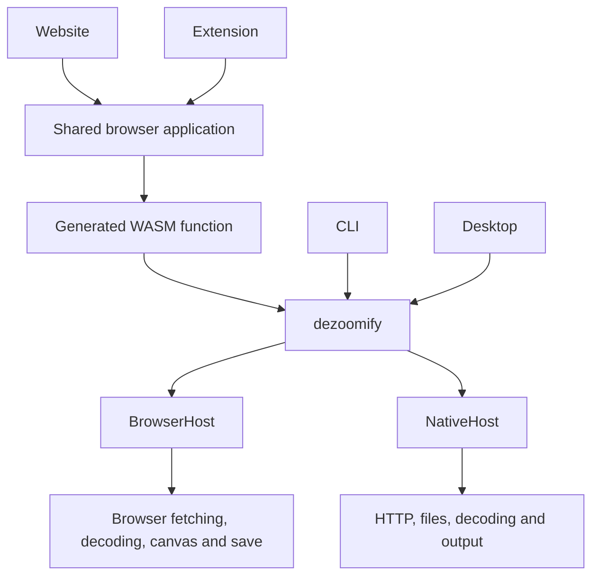

# Architecture

All four products call `dezoomify(inputs, options, host)`, one asynchronous Rust
function. It discovers images, chooses a level, acquires tiles with bounded
concurrency, resolves partial output, and awaits the actual save result.

```mermaid
flowchart TB
    Website --> App[Shared browser application]
    Extension --> App
    App --> WASM[Generated WASM function]
    WASM --> Core[dezoomify]
    CLI --> Core
    Desktop --> Core
    Core --> Browser[BrowserHost]
    Core --> Native[NativeHost]
    Browser --> BrowserIO[Browser fetching, decoding, canvas and save]
    Native --> NativeIO[HTTP, files, decoding and output]
```

## Rust algorithm

`crates/dezoomify` contains the shared algorithm, domain values, format parsers,
geometry, selection rules, and retry policy. It performs platform operations only
through injected `Host` methods. It imports no network, filesystem, clock, UI,
or image-codec implementation. Parsing and planning remain deterministic.

`model.rs` defines the values crossing language boundaries. `host.rs` defines
one capability list that generates the Rust trait and JavaScript method bindings.
The generated TypeScript declaration is tracked in `packages/wasm-bindings`.
See [Bindings](bindings.md) and [Algorithm](algorithm.md).

Formats register in one ordered registry. Registry order breaks ties between
equally relevant format matches. `ImagePlan` validates ready images and their
tile counts. `CatalogPlan` collects multiple ready images or deferred links.
`ResolvedLevel::grid` provides regular geometry; format-owned tile sources
provide overlap, padding, probes, and custom placement. Tile requests are lazy.

Formats declare metadata, image-address, and viewer routes. Decoders receive the
requested URL, redirected URL, bytes, and branch-local parent resources.
References resolve against the redirected base. Named captures can resolve
links, decode HTML entities, and fill resource addresses. Routes that require a
previously read parent retain that parent explicitly.

Inline OpenSeadragon Zoomify services use floor-halving, including their smallest
single-tile level. Tile groups count actual preceding tiles. XML `NUMTILES`
heuristics apply only to XML metadata.

## Hosts

`crates/dezoomify-native` implements `NativeHost` for CLI and desktop. It owns
HTTP and local resource reads, authentication, cache, decode workers, memory and
spool accounting, encoders, publication, and cancellation cleanup.

`packages/browser-runtime/src/browser-host.ts` implements `BrowserHost` for website and
extension. It owns readable bytes or ordinary image display, decoding, canvas
assembly, output, and awaited interaction callbacks. Both browser products use
one application flow with injected input, transport, permission, save, and
optional toolbar capabilities.

`crates/dezoomify-wasm` converts values and futures. It has no platform I/O,
canvas, storage, or application policy. Imported object methods call the supplied
Host directly; the exported function awaits the same Rust algorithm as native.

## Shared UI and application

`packages/shared-ui` contains React components, translations, pure presentation
functions, history, queue utilities, labels, and bounded diagnostics. It has no
host globals. Browser application code may import the shared UI; browser
transport and image operations receive callbacks.

One browser invocation owns cancellation, pause, pending interactions, progress,
and retirement. A replacement invocation cannot receive its predecessor's
progress or output. Completed output stays available until the user retires it.
Desktop retains only the task ownership and IPC required by its process boundary.
See [Application](application.md).

## Website and proxy

The assembled website serves the legacy product at `/` and the new product at
`/beta`. The deploy workflow builds both; it does not serve repository sources.

`src/server/proxy.ts` owns metadata proxy policy. Cloudflare Pages and the local
development server translate HTTP requests into the same function. Eligibility,
credential restrictions, redirect checks, limits, and CORS behavior have one
implementation. See [Browser runtime](browser-runtime.md) and [Security](security.md).

Generated help pages include a copy of the shared UI theme beside their HTML under `/beta/help/`, so their typography, navigation, surfaces, and automatic light and dark colors use the same CSS as the app without depending on repository source URLs.

## Boundaries

- Products never import each other.
- Parsers and geometry import domain values; the shared algorithm calls injected Host methods.
- Platform implementations own I/O, resources, and clocks, with no duplicate selection or retry policy.
- Shared UI imports domain declarations and local utilities, with no host globals.
- Browser application modules may compose UI and Host; image and transport modules remain independent of UI.
- Crossing values derive from Rust declarations. URLs, headers, errors, and geometry retain their exact meaning.
- Errors carry stable codes and structured context; callers never branch on display text.

Biome rejects product package and sibling-app imports. Shared packages and the website's deployed proxy entrypoints remain valid dependencies.
