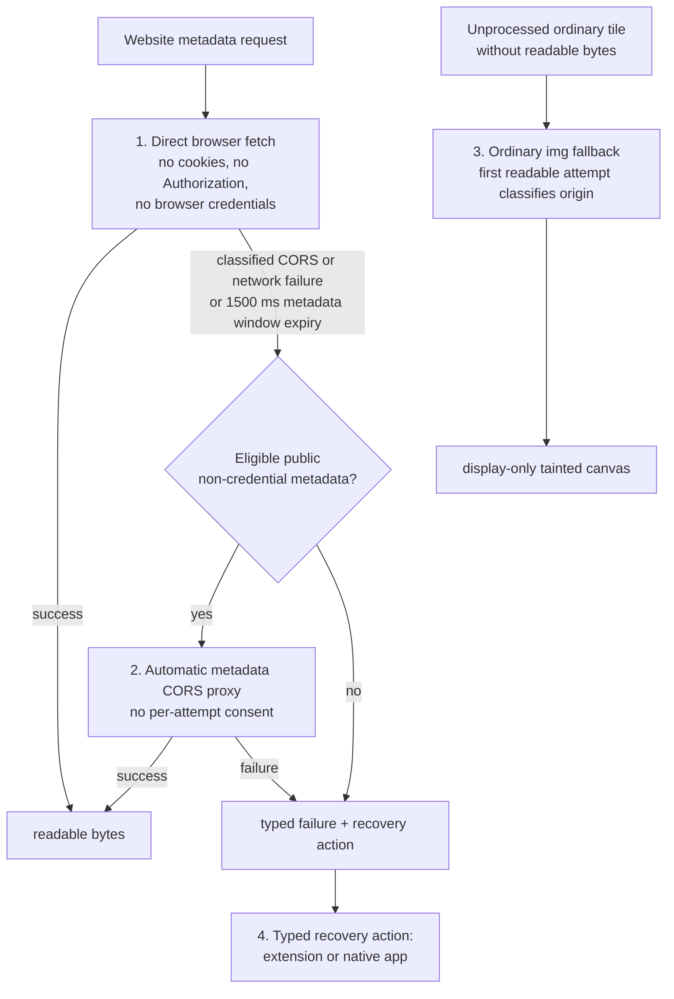

# Browser runtime

`packages/browser-runtime` runs `crates/dezoomify-wasm` in the browser. It owns fetching, workers, decoding, tile painting, canvases, and save surfaces. It contains no UI.

## Engine-effect assembly

The website and the extension job tab share one browser `JobService`
(`browser-job-service.ts`) and engine host (`engine-host.ts`) over the WASM session;
they differ only in transport and output surface. The runner owns validation,
job identity, observer forwarding, and disposal directly, without an
app-model forwarding wrapper. The runtime owns no job policy (retries,
cancellation, partials, ordering stay in the engine). Effect meanings are
defined in the [host-effect contract](job-engine.md#host-effect-contract);
browser execution only below.

The shared runtime calls the product's tile fetch callback once per engine acquisition. The website callback performs one direct fetch; the extension retains its source-to-extension fallback, with each selected route attempted once. Typed failures preserve the stable transport code, HTTP status, route, and any `Retry-After` hint in milliseconds; the engine alone decides whether and when to retry. Metadata keeps its direct-first fetch and eligible proxy fallback policy below, including its bounded proxy rate-limit retry.

- `acquire-tile`: the website checks and shows the declared canvas before the first tile, then decodes and paints each good tile at once. The visible canvas is the output throughout, including while paused. Bad tiles fail the acquisition and flow into engine retry/partial handling. Probes (`purpose: probe`) share the `probe.ts` helper; a probe kept for output also paints at once.
- `finalize-output`: encodes the surface already on screen and returns the product's actual output disposition. The website reports `browser-save-ready` when its blob URL is ready for the user's save click; the extension reports `browser-save-initiated` after starting its anchor save. A tainted canvas reports `display-only`. Plans lacking declared dimensions size the surface from accumulated placements here. Over-limit dimensions fail typed (`PLAN_INVALID` plus a desktop handoff) before allocation.
- Tiles draw at planned placement, 1:1 scale. Pixels past the planned edge crop from right and bottom (padded edge tiles); short tiles leave the gap empty. Each bitmap closes right after painting.
- A clean output reports its actual product disposition; the extension starts an anchor save during finalization, while the website readies a blob URL for its later save click. The extension uses no `downloads` permission. Resources then release and one typed reply goes back. A tainted display-only canvas skips encoding.

Tiles the browser reads as bytes take the WASM `applyProcessing` path per the core recipe. Ordinary unprocessed tiles without readable bytes fall back to plain `` (display-only): the canvas taints, no bytes result, the job ends display-only. Only the first tile per origin tries readable bytes; later tiles go straight to ``. Website and extension starts explicitly request the engine's largest-fitting selection policy with the browser's width, height, and area limits. The engine chooses the ready image and level, or follows deferred catalog entries on the same job within its existing bound. The shared UI has no manual image or level chooser. Generic browser-job-service and WASM sessions that omit the automatic policy can still use generated catalog snapshots and the public `select-image`, `select-level`, and `follow-deferred` commands; a host that starts such a session supplies its own interaction policy.

## Generated WASM boundary

`worker-host.ts` imports session and message types from `@dezoomify/wasm-bindings` and declares no Rust contract types in parallel. `engine-host.ts` handles generated effects through one exhaustive typed table; each product does the same for events. It is the single browser conversion from closed `HostFailure` to `FetchFailure`; the Rust session adds its correlated request to build `Error`. See [Protocol](protocol.md#wasm-session-abi).

## Catalog boundary

Hosts consume the ordered generated `Catalog` as is. `Image` entries carry optional `size` and selectable levels with optional `size` and `tileSize`; absent geometry stays unknown. `ImageRequest` entries carry the follow-up `uri` of deferred metadata (a IIIF service, a bulk-list entry) for a fresh bounded attempt. Hosts define no catalog types of their own.

## Ordinary image display

For ordinary website tiles with `ProcessingRecipe::None`, the runtime loads through `` and draws into a canvas even when the source taints it. The picture stays visible (browser right-click save where available).

Once tainted, the runtime never runs pixel reads, hashing, processing, `toBlob`, or `toDataURL` on that canvas and never promises a programmatic save. The website says so before rendering and points at a readable route (extension or desktop app) when the job needs processing or a clean save. Budgets are in [Compatibility](compatibility.md#canvas-and-save-limits).

## Readable-byte fetching

Readable metadata, processed tiles, and clean saves start with direct browser fetch. After a classified CORS or network failure, the website retries only an eligible public, non-credential metadata request through the metadata proxy; tiles never use the proxy, so readable tile bytes on CORS-blocked sources need the extension or desktop app. Bytes go to workers for decode, core-recipe processing, and save assembly. Size limits are checked before allocation.

Object URLs live for one job and are then revoked.

The website activity log records one result per transport attempt with the
requested URL, route, HTTP status when readable, and byte count on success.
Direct fetches include content type and a bounded server-body signal on HTTP
errors; proxy failures include their code and policy reason. Redirects include
the final URL when available. Network/CORS failures and ordinary image loads
explicitly identify unavailable responses or HTTP status; they never invent a
server response. Cancelled fetches and disposed engine effects add no failure
noise. Engine bookkeeping stays at debug level, outside the default activity
log. These diagnostics remain local under the [credential rules](security.md#credentials).

## Request order

This order is canonical; all other pages link here instead of restating it.

1. Direct browser fetch with cookies, `Authorization`, and browser credentials omitted.
2. After a classified CORS or network failure, or a direct fetch not completing within the 1500 ms metadata window, automatic metadata CORS proxy fallback when the metadata request is public and non-credential.
3. For unprocessed ordinary tiles, one direct readable attempt classifies each origin. A successful ordinary `` fallback marks that origin display-only for the job, so later ordinary tiles load directly through ``.
4. A typed recovery action offering the [extension](extension.md) or [native app](native-apps.md) when no accepted browser route supplies readable bytes.

The website always shows the active transport, including the automatic switch after a classified direct failure. No per-attempt consent exists.

The extension transport is tab-origin direct fetch plus `` display-only fallback; see [Extension](extension.md#fetching). The extension never uses the metadata proxy.

The proxy serves metadata only, never tiles. Both legs (browser-to-proxy, proxy-upstream) omit cookies, `Authorization`, and browser credentials. It accepts only validated public metadata requests, blocks private/local networks, bounds redirects/size/duration, strips non-allowlisted headers, and returns explicit CORS headers. The page holds at most 4 proxy requests in flight and starts at most 4 per second under one global budget; direct tile requests keep separate per-host pacing. Details are in [Security](security.md#proxy-controls).

## Limits and capabilities

At startup the runtime reports codec support, worker and storage availability, maximum practical canvas and allocation sizes, proxy availability, and supported output modes. The job engine validates plans against these [capabilities](protocol.md#product-capabilities). A job exceeding browser limits fails with a typed error pointing to the native app.
