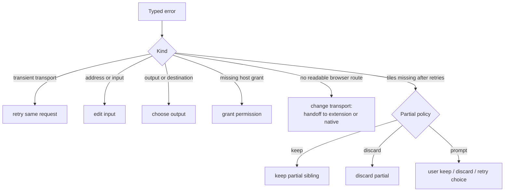

# Errors and recovery

Every runtime reports failures the same way: a typed error naming what failed, never a raw Rust, JavaScript, browser, HTTP, or OS exception.

## Error shape

Each error includes:

- a stable namespaced code such as `fetch.cors_blocked` or `decode.unsupported`;
- the job phase and affected resource or tile when safe;
- the attempted and active transport when relevant and safe;
- whether retry is valid;
- a concise user message;
- an ordered set of permitted recovery actions;
- optional redacted request, transport, blocked-reason, resource-kind, HTTP status, bounded server signal, and diagnostic detail.

Codes are stable API; messages improve freely. Secrets, cookies, auth headers, signed query values, and local paths are redacted before logging or serialization.

Hosts keep their own error chains internally; only the typed shape crosses the contract. Browser code classifies a fetch failure once into `FetchFailureDto` (host-observed facts only). The Rust session adds the correlated request: metadata failures are `discovery`, tile/probe failures are `acquisition`, request URI and kind come from the emitted effect. Product code adds no context of its own. Output failures use phase `output`. Never branch on display strings.

Adapter faults (bad external objects, bad session use) are not job failures. They return the `DispatchResult` error branch and a contract-failure screen, and replace no accepted transport failure.

## Recovery actions

Recovery is data, not text for the UI to parse. Each action carries an id, one kind (`retry`, `edit-input`, `choose-output`, `grant-permission`, `change-transport`, `keep-partial`, `discard-partial`, `handoff-to-native`), a scope, and a rationale. The engine rejects stale or forged actions by job revision and action id.

The website transport transition is automatic for eligible metadata (no per-attempt consent action); see [Browser runtime](browser-runtime.md#request-order).

## User presentation

Messages follow the layered rules in [Product](product.md#progressive-disclosure):

- First: one specific plain sentence (what failed for this job, which step and resource, which route) plus the single best next action. No shared generic template across causes.
- Jargon waits for expandable details and linked docs. Wording is driven by structured context (code, phase, transport, kind, blocked reason, redacted origin), so identical causes read identically everywhere.
- A fetch failure is the job outcome: plain message plus stable code up front; engine diagnostics (for discovery, the headline-free per-format bullets) only inside expandable details.
- User and technical wording never mix. Each fetch failure carries a plain sentence for the user plus a typed `FetchCause` (code, HTTP status, transport kind, policy reason) for the engine. Discovery diagnostics group on the typed `(kind, cause)` key, never on rendered text. A proxy-denied cause names relay code, HTTP status, and policy reason, so policy denials never read as upstream refusals and vice versa.
- Details stay on the device: full request URL verbatim, HTTP status only for HTTP refusals, an optional bounded server signal (4 KiB read, 300 chars kept, markup and control chars stripped), the engine block, one trailing context line. Copy-diagnostics keeps typed context, job/attempt ids, app and protocol versions, URL, and server signal; never cookies or credentials. Format URL-shape misses (`DidNotMatchUrl`, nothing fetched) collapse to a count; fetch rejections group by typed `(kind, cause)` under format names; other rejections group by `(kind, detail)`.
- Every code has user wording; a code without wording is a release defect. Only transient failures invite retry; policy denials and upstream 4xx name the next app or address fix instead. Retry re-runs the same request, never a reset. Start over exists only where a new address is accepted (website, desktop); the extension job tab stays bound to the scanned page.

## Failure policy

Transient transport and service errors follow the [retry policy](job-engine.md#retry-and-progress). Proxy-ineligible, auth, and ordinary HTTP failures never take the proxy route. Invalid metadata and deterministic decode failures stop at once. A tile failure reaches partial handling only after retries run out.

Internal errors offer a safe fallback. Native Messaging mismatch stops before job creation. Security-policy failures never offer a recovery that weakens the policy; see [Security](security.md).
