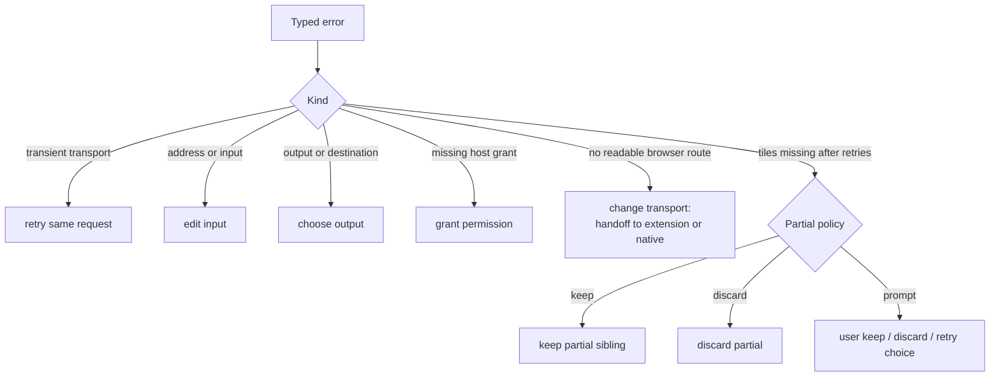

# Errors and recovery

Every runtime reports failures the same way: a typed error naming what failed, never a raw Rust, JavaScript, browser, HTTP, or OS exception.

## Error shape

Each error includes:

- a stable code such as `TRANSPORT_HTTP_ERROR` or `TILE_DECODE_FAILED`;
- the job phase and affected resource or tile when safe;
- the attempted and active transport when relevant and safe;
- the derived retry verdict (`retry::is_retryable(code, http)` decides, with
  HTTP status taking precedence; the verdict is recomputed whenever the code
  changes, and job-level aggregates derive it from their retained failure
  set — it is never set independently);
- a concise user message;
- optional structured limit facts (limit reason, dimensions, required and
  available bytes) for output-limit refusals;
- optional request, transport, blocked-reason, resource-kind, HTTP status, bounded server signal, and diagnostic detail.

Codes are stable API; messages improve freely. Diagnostic reports retain exact URLs, paths, and settings under the [diagnostic capture contract](security.md#credentials).

Hosts keep their own error chains internally; only the typed shape crosses the contract. Browser code classifies a fetch failure once into `FetchFailure` (host-observed facts only). Host operations attach the URI and kind from their `ResourceRequest`: metadata failures are `discovery`, and tile/probe fetch failures are `acquisition`. The algorithm preserves this context when reporting failed discovery and missing tiles. Output failures use phase `output`. Never branch on display strings.

Extension HTTP responses produce the generated `FetchFailure` at the fetch boundary. Source-script results carry that payload unchanged through validation and transport choice. BrowserHost rejects with the structured domain error. HTTP status and request context remain intact; only unclassified host exceptions require classification.

`FetchFailure` describes observed browser fetch facts. The core's `retry::is_retryable` classifies the code and HTTP status for tile retries and metadata error presentation. HTTP status takes precedence over the transport code. `Error` carries that derived verdict (every construction and code rewrite recomputes it; job-level aggregates derive it from their retained failure set, so any transient constituent keeps retry available), so presentation never sees a verdict that disagrees with its facts; missing tiles retain these errors for each failed attempt. Output failures do not inherit fetch retry policy.

## Recovery actions

Products choose recovery controls from stable error codes, structured context, and available capabilities. They never parse user-facing text. The algorithm awaits the Host's keep, discard, or retry choice when tiles remain missing. Pending interactions belong to one invocation and close when it retires.

```mermaid
flowchart TD
    E[Typed error] --> K{Kind}
    K -->|transient transport| R[retry same request]
    K -->|address or input| EI[edit input]
    K -->|output or destination| CO[choose output]
    K -->|missing host grant| GP[grant permission]
    K -->|no readable browser route| CT[change transport:<br/>handoff to extension or native]
    K -->|tiles missing after retries| PD{Partial policy}
    PD -->|keep| KP[keep partial sibling]
    PD -->|discard| DP[discard partial]
    PD -->|prompt| UC[user keep / discard / retry choice]
```

The website transport transition is automatic for eligible metadata (no per-attempt consent action); see [Browser runtime](browser-runtime.md#request-order).

## User presentation

Messages follow the presentation rules in [Product](product.md#progressive-disclosure):

- First: one specific plain sentence (what failed for this job, which step and resource, which route) plus the single best next action. No shared generic template across causes.
- Jargon waits for expandable details and linked docs. Wording is driven by structured context (code, phase, transport, kind, blocked reason, source origin, structured limit facts), so identical causes read identically everywhere.
- A fetch failure is the job outcome: plain message plus stable code up front; discovery diagnostics (for discovery, the headline-free per-format bullets) only inside expandable details.
- User and technical wording never mix. Fetch failures preserve code, HTTP status, transport, policy reason, and diagnostic detail in the generated domain types. Product wording uses a plain sentence derived from those facts. Discovery diagnostics group by code, HTTP status, transport, and policy reason, never by rendered text. A proxy denial retains the proxy code, HTTP status, and policy reason, so policy denials never read as upstream refusals and vice versa.
- Details stay on the device in the diagnostic report: full request URL, observed HTTP status, bounded server signal, and discovery failure context. Format URL-shape misses (`DidNotMatchUrl`, nothing fetched) collapse to a count; fetch rejections group by their structured facts under format names; other rejections group by `(kind, detail)`.
- Every code has user wording; a code without wording is a release defect. Only transient failures invite retry; policy denials and upstream 4xx name the next app or address fix instead. Retry re-runs the same request, never a reset. Start over exists only where a new address is accepted (website, desktop); the extension job tab stays bound to the scanned page.

## Failure policy

Transient transport and service errors follow the [retry policy](algorithm.md#retry-and-progress). Proxy-ineligible, auth, and ordinary HTTP failures never take the proxy route. Invalid metadata and deterministic decode failures stop at once. A tile failure reaches partial handling only after retries run out. Browser canvas output failures (allocation, 2D context, PNG encoding) stop the job typed at once, never as one tile's failure, and their report always carries the desktop-app action.

Internal errors offer a safe fallback. Security-policy failures never offer a recovery that weakens the policy; see [Security](security.md).

## Diagnostic reports

Each product attempt owns a versioned `DiagnosticReport`, independent of console verbosity. It includes input, settings, build context, selected geometry, counters, bounded events, grouped first/last failures, and a protected terminal outcome. Successful tile requests count without filling the timeline; debug retains discovery, trace prints individual successful requests when explicitly enabled. The pure core performs no ambient logging.

Reports cap the timeline at 1,000 records and the entire serialized report at 1 MiB, including context, failure samples, and outcome. Strings and field counts are bounded before retention; omitted records and truncated fields are counted. Graphical products retain at most ten retired reports in memory, capped at 10 MiB, and expose the current report after success, cancellation, and failure. Clipboard rejection never claims success. Issue drafts respect an encoded URL limit; the complete report remains available to copy or save.

Native callers keep the recorder even when validation or execution fails. Desktop reads it through `get_job_diagnostics`; the CLI uses its existing `--logging` levels to filter diagnostic events on stderr, independently of `--json` stdout. Human progress prints on phase changes and at most once per second within a phase.
