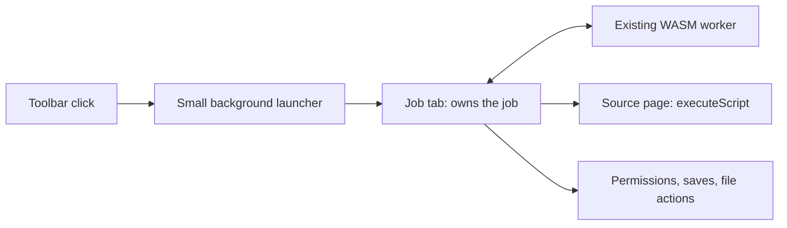

# Browser Extension

The extension is MV3 in Chromium and Firefox. The toolbar click grants access to the active tab and opens a dedicated job page. The job page owns discovery, the engine, browser permissions, retry and cancellation, saving, and presentation. The background is a toolbar launcher with a small in-memory source-tab-to-job-tab directory.



## Background launcher

The background opens `job.html#sourceTabId=<id>` for the clicked tab. A repeated click focuses the existing job tab and sends one `dz.toolbar-click` event; the job page cancels an active job and leaves a completed job available. Closing either tab removes the directory entry. The background does not scan, fetch, prompt for permissions, maintain job state, or relay engine messages. A background restart does not stop a job already owned by its tab.

The launcher uses only the toolbar click and tab APIs needed to open and focus the job. The test-only runtime messages are absent from production behavior. The package declares no permanent host permissions or content scripts.

## Job ownership and discovery

The job page reads the source tab ID from its fragment, gets that tab's current URL, and creates one source-access object for that document. Each attempt calls `scan()` once, then starts the shared browser job service and its existing WASM worker. A retry disposes that engine attempt, takes one fresh snapshot from the same source document, and starts a new attempt. There is no follow-up candidate push or extension-specific engine RPC.

`source-access.ts` exposes two ordinary asynchronous calls:

```ts
const inputs = await source.scan();
const result = await source.fetch(request, signal);
```

The module injects the self-contained functions in `job/source-operations.ts` with `scripting.executeScript({ target: { tabId, frameIds: [0] } })`. Their argument and return shapes come from `Parameters`, `Awaited`, and `ReturnType`; the job page validates URLs, headers, document identity, result shape, candidate and payload limits at this browser boundary.

One source-access object is bound to one source document. A loading event, tab close, changed URL, or returned result from another document invalidates it. It discards results that finish after invalidation. A job that already has inputs can continue through the extension-origin transport when source-context access is lost; the source tab is never silently rebound after navigation. Firefox document IDs are not required, so the current Firefox 133 minimum remains supported.

The source fetch operation uses a per-document abort-controller map in the extension isolated world. The job service's abort signal cancels an in-flight source fetch. Responses are streamed and capped at 8 MiB before they cross the script boundary as base64; the job page decodes and checks the payload once.

## Fetching and permissions

Each attempt owns `permissions.ensure(origin, signal)` around extension-origin fetching. Concurrent requests to an origin share a pending grant; other origins wait independently. The visible action calls the browser permission API synchronously, verifies the retained grant, and settles only that origin's waiters. Denial fails typed. Cancellation removes waiters, and late grants cannot affect replacement attempts. An upstream 401/403 never reopens a permission prompt. Shared runtime handles contain no permission coordination.

`activeTab` and `scripting` grant one explicit source-page scan after the toolbar click; `downloads` lets the job page confirm that its generated file finished saving. Same-origin reads carry the page's browser session, including its cookies. Metadata and requests for the source page's own origin use this context first. A source-context failure falls back to the extension-origin transport; a definitive HTTP refusal remains a typed failure. Cross-origin tiles use the extension-origin transport under an explicitly granted optional host permission. The permission request is made synchronously from the visible job-page action so the browser retains user activation. The job page checks and observes permissions directly; there is no permission mirror in the background.

Extension-origin requests attach no cookies or `Authorization` header and follow redirects through browser fetch. Redirect responses do not disclose their bytes to the redirecting site. The extension never uses the metadata proxy. Ordinary unprocessed tiles without readable bytes fall back to `` display, which is visible but tainted and cannot be read or saved.

## Job, save, and display

The job page hosts the shared [engine-effect assembly](browser-runtime.md#engine-effect-assembly): worker, WASM session, transport, decode, canvas, save, and shared UI. It selects the largest image and fitting level. The engine owns retries, partial decisions, and ordering. A clean canvas is saved from a Blob URL through the browser download manager; the engine completes only after the manager confirms the file. Cancellation cancels an unfinished download, and its Blob URL is revoked after the result settles. A tainted output remains display-only. Product actions stay in the job page.

Failures and retry actions stay in the job page. A retry takes another bounded source snapshot only if the original source document is still live. No Start over exists; a new job starts from the toolbar on the source page.

## Packaging and tests

WXT generates both MV3 manifests from `apps/extension/wxt.config.ts` (Chromium service worker and Firefox classic background script). The store package ships the launcher, job page, shared UI, browser runtime, icons, and WASM. It has no content scripts or fallback pages.

The browser suite runs the packaged extension in Chromium and Firefox. It covers direct job-page source scanning, authenticated source fetching, source navigation invalidation, extension-origin fallback, and output behavior. Chromium also closes and restarts the background worker after a completed job and proves that the job page can still scan and fetch from the source tab.

Build, dev, test, and release regenerate the WASM glue before WXT builds. The job-worker unit contract runs a real generated WASM session; a missing, stale, or incompatible binding blocks before browser E2E. Packaging needs root workspace dependencies (`cargo xtask setup` or `pnpm install --frozen-lockfile`).

Same engine and fixture contracts as web and desktop govern job behavior. See [Testing](testing.md), [Releases](releases.md), and the [user guide](user/browser-extension.md).

## Diagnostics

The job page and WASM worker log structured milestones for scans, source fetches, extension-origin fallback, permission prompts, engine commands, and failures. The job page mirrors accepted lines and `engine.log` entries into technical details and copied diagnostics. There is no background job log or cross-context trace protocol.
