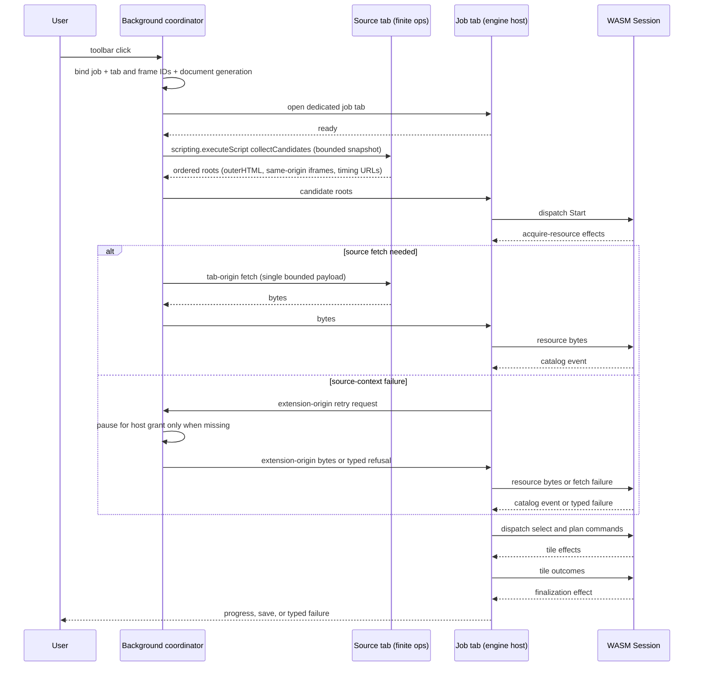

# Browser Extension

MV3 in both browsers from one manifest base: service-worker background on Chromium, event-page background on Firefox. The toolbar click starts one job on exactly the clicked tab. The background opens a dedicated job tab and runs finite operations in the clicked tab; it never reloads the source page, installs a collector, or watches other tabs.

## Discovery

Scanning starts only on toolbar click or on retry of a retryable failure in the job tab. Grey icon while idle, blue with a dot while active. Navigation, tab close, cancellation, or worker restart invalidates the binding. Bindings live in background memory for the lifetime of the background context; after a worker restart, the user starts a fresh job with the toolbar button. The background never polls or lists tabs. Every attempt takes exactly one bounded snapshot; a retry drops any in-flight snapshot and starts a new engine attempt.

The first batch holds the top document's rendered `outerHTML`, then rendered DOM of readable same-origin iframes, then URL-only references from the tab's performance timeline. Cross-origin iframes are skipped. The background observes no traffic (a permissionless `webRequest` listener hears nothing; `activeTab` grants no observation). No permanent host permissions are declared.

Core runs as WASM inside the job tab. It evaluates captured DOM bytes before fetching URL-only roots; the first root yielding an image confirms detection.

`apps/extension/src/background/source-operations.ts` holds the two functions passed to `scripting.executeScript()`: one snapshots rendered roots plus retained resource-timing entries once the job tab is ready; the other fetches in the tab's origin and returns one bounded base64 payload. Neither registers a listener. A follow-up snapshot is bounded and deduplicated when discovery asks for more candidates. A stale binding or failed start shows an error badge; the extension never silently opens another page.

## Fetching

Readable bytes come from a tab-origin fetch under the narrowest grant: `activeTab` for the clicked tab, or an explicitly granted host permission for another origin. The tab origin carries the page's own session, so referrer- and cookie-protected same-origin tiles look like the viewer. The independent extension-origin transport is credential-free with browser-native redirect following: requests attach no cookies or `Authorization`, and response bytes never return to a redirecting site, so a redirect can neither misuse the user's session nor disclose the target's data to the redirecting site. Public servers answering `Access-Control-Allow-Origin: *` stay readable. Metadata and requests for the bound source document's own origin try the tab origin first, pausing for the grant only when missing; a source-tab failure retries through the extension-origin transport. Cross-origin tiles always use the extension origin under a granted host permission. A granted-origin 401/403 fails typed with no re-prompt; grants fix no refusals. Every operation validates URL, method, headers, shape, and byte cap.

The extension never uses the metadata proxy. Ordinary unprocessed tiles without readable bytes fall back to `` display: visible but tainted, no reads or saves. Canonical transport labels and save-name helpers live in `packages/app-model`.

## Job and save

The job tab discovers, selects, plans, processes, and assembles on a canvas through the shared [engine-effect assembly](browser-runtime.md#engine-effect-assembly). A clean canvas saves via Blob URL plus anchor click (no `downloads` permission). A tainted canvas ends display-only with no later pixel reads or serialization.

Job failures stay in the job tab. Background failures keep an error badge until the next click or until the source tab leaves the bound page. Retry takes a fresh snapshot and starts a new attempt. No Start over exists: a new job starts at the page's toolbar button.

## Packaging

WXT generates both MV3 manifests from `apps/extension/wxt.config.ts` (Chromium: bundled `background.js` service worker; Firefox: same classic IIFE via `background.scripts`, parsed with `node --check`). The store package ships only the background coordinator, the job tab (workspace shared UI plus browser runtime), icons, and WASM. No content scripts or fallback pages are packaged or tested.

Build, dev, test, and release regenerate the WASM glue from current Rust before WXT builds. The test gate does so before units, whose worker contract runs a real generated WASM session through the first discovery round trip; a missing, stale, or incompatible binding blocks before browser E2E. Packaging needs root workspace dependencies (`cargo xtask setup` or `pnpm install --frozen-lockfile`) and invokes no second package manager.

Same protocol and scenarios as web and desktop govern job behavior. See [Testing](testing.md) and [Releases](releases.md). User use: [browser extension](user/browser-extension.md).

## Diagnostics

Each context logs structured console lines (`[<context>] [<code> ]<detail>`): `background` (coordinator; the default, so its bracket is omitted), `job` (job tab), `worker` (WASM session worker). Together they trace tab interactions (`toolbar-click`, `active-tab-op-start`/`active-tab-op-result`, `source-fetch-*`, `permission-check`, `source-invalidated`) and core interactions (`session-created`, `command-dispatched`, `messages-returned`, `effect-*`, `engine-event`, `core-error`).

The logger lives in `packages/browser-runtime/src/logging.ts`, imported via the `./logging` subpath, never the barrel. The job tab mirrors accepted lines plus forwarded `engine.log` lines into the technical-details log, so job views, failed views, and copied diagnostics carry the trace.

Milestones log at info, per-tile detail at debug, recoverable states at warn, terminal failures at error; default is info. URLs log in full; details are bounded.

## Appendix: source binding and job-tab contract

One background coordinator, finite operations in the clicked tab, one job tab per job. The coordinator owns the bindings. Webpage `postMessage` is no job-control channel.

Every source- or job-originated request carries a host-local binding (`job`, browser-verified tab and frame IDs, document generation) plus one request sequence. The coordinator checks sender tab and frame against the stored binding before routing. Navigation bumps `document_generation`; older-generation messages die. A source-tab navigation invalidates only source-context transport; extension-origin transport survives for the same job.

Bindings and granted-origin state live only in background memory. A worker restart drops them, so the user starts a fresh job with the toolbar button. Closing source or job tab cancels in-flight work and releases the in-memory binding.

`collectCandidates` snapshots rendered `outerHTML` for the document and readable same-origin iframes, then URL-only retained timing entries; cross-origin iframes are skipped. Follow-up snapshots are optional, bounded, and coordinator-deduplicated. No persistent observer exists. Overflow returns as diagnostics, never silent discard.

Candidate and fetch messages use one closed TypeScript union private to the installed build; no cross-version interface. Cancellation stops the source fetch before more bytes are kept. No webpage frame receives extension runtime messages.

Outcome classes cover document loss, access required, redirect limits, cancellation, network/throttling, malformed responses, streaming limits, and channel loss. Source-context failure falls back to extension-origin transport; a definitive HTTP response returns straight to discovery (repeating fixes nothing). Missing-grant (`permission-denied`) pauses with host names and rationale; only a visible job-tab action opens the permission prompt. Granted-origin 401/403 is an upstream refusal, not a missing grant: typed failure, no pause. Redirects are followed credential-free by the browser under the initial origin's grant.

The job tab hosts the full engine (dedicated worker, one WASM `Session`, shared browser-runtime executor) with no second state machine:

- The extension start explicitly requests the engine's largest-fitting selection policy with browser width, height, and area limits. The engine chooses the largest ready image and fitting level, follows deferred `ImageRequest` entries on the same job within its existing bound, and returns a typed terminal when no image can be selected. The extension can still send the public `select-image`, `select-level`, and `follow-deferred` commands for manual selection flows.
- Tiles decode during acquisition: undecodable tiles fail the outcome into engine retry/partial handling. Decoded pixels stay host-side and never re-enter the adapter.
- `finalize-output` validates dimensions and area, assembles, encodes, saves, releases, and replies once; completion follows the reply.
- `request-decision` renders keep/discard in the job tab; only the user action sends `answer-partial{generation, decision}`.
- Host execution failure is terminal: render, cancel the engine job, fake no later effects.
- Recipes beyond `none` fail typed (`TILE_PROCESSING_UNAVAILABLE`); those sources need the native app until the engine contract grows processing effects.
