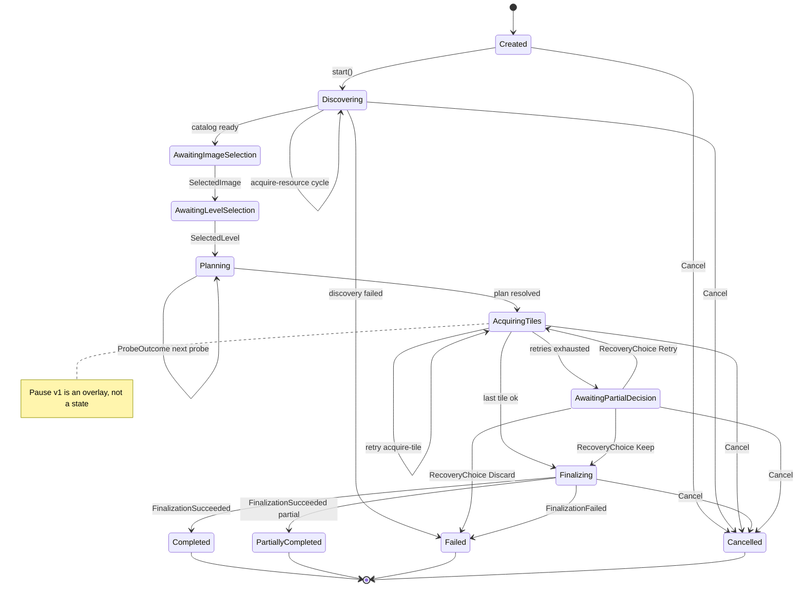

# Job engine

`crates/dezoomify-engine` is the deterministic state machine behind every job. It decides what happens next; hosts do it. It never touches I/O, pixels, time, or output files. The browser runtime drives it through the WASM bridge; the native runtime drives it directly. Shared scenarios assert both runtimes behave the same.

## Model

A job holds fixed input intent plus evolving state: discovery, selection, planning, tile acquisition, outstanding request/decision numbers, finalization, failure, cancellation. Destinations and save progress belong to the host, not the job. Routing tokens stay outside the job.

The engine takes a typed `JobCommand` and appends typed effects and events to one FIFO queue. Every message carries a checked `u32` sequence; requests, tiles, and decision generations are numbers scoped to the job, so late, duplicate, and out-of-order replies die before touching state. The host feeds retry wakeups explicitly, so replaying the same inputs replays the same state.

## Phases

Discovery, selection, planning, tile acquisition, then one awaited finalization. The engine exposes only phases it observes; codec and save progress are product-local UI events.

Selection is explicit when discovery finds several images or levels. Commands carry zero-based positions into the kept catalog. Headless callers pass a deterministic selection rule up front; the engine never guesses. Discovery also returns still-deferred entries (a IIIF service, a bulk-list entry) as `ImageRequest` items carrying a follow-up URI; the host follows one with a fresh bounded job instead of selecting it.

## Retry and progress

The engine schedules retries; the host waits and re-requests. The website proxy transition (one proxy effect for eligible metadata after a classified direct failure or metadata-window expiry) runs before ordinary same-transport retry; see [Browser runtime](browser-runtime.md#request-order). Auth failures, bad metadata, unknown formats, and deterministic decode failures never retry.

Typed tile failures carry structured facts (stable code, HTTP status, `retry_after_ms` hint, bounded diagnostics) instead of one boolean. Permanent failures (auth refusals such as HTTP 403, other 4xx, bad metadata, deterministic decode failures, unknown codes) settle the tile after exactly one attempt. Transient failures (timeouts, network errors, rate limits, 5xx) retry up to the exact budget (`max_retries` retries after the initial attempt) with one explicit `WaitForRetry` timer effect per retry; the delay is a 1 s base doubling to a 30 s ceiling, with an observed `retry-after` honored to 300 s. The host owns the clock and reports the elapsed timer back, so the engine schedules no work from silence. The legacy boolean outcome stays for already-shipped hosts and treats `ok: false` as a transient failure with immediate retry.

A settled-as-failed tile joins the partial decision only after acquisition settles (nothing in flight, queued, or awaiting a timer), so late successes still count and the missing list is complete with full structured detail per tile. A partial retry requeues exactly the settled-as-failed tiles in plan order with a fresh attempt budget and preserves successes.

Progress counts work units per phase (completed, active, queued, failed, total where known). Byte counts supplement unit counts. Progress never moves backward and never claims unknown totals as complete.

## Cancel and partial output

Cancel is a command. The engine stops new work and emits one idempotent `cancel-work` instruction before reaching `cancelled`.

Partial policy, picked up front:

- `fail`: missing tiles mean no output;
- `keep`: the gappy result is encoded with missing regions marked;
- `prompt`: the job pauses and asks (typed keep/discard/retry).

Partial results list every missing tile and keep the error behind each gap. A kept partial publishes only after successful encode and finalization. Metadata, permission, destination, encoding, and publication failures never become partial success.

## Pause v1 (suspend-acquisition)

Pause is an overlay, not a state; `Job::is_paused` reports it. `Pause` works in any non-terminal state (post-terminal inputs stay `job.post-terminal`); double pause returns `Ignored`; `Resume` without pause is `job.invalid-state`. Cancel wins while paused.

While paused the engine schedules no new `acquire-tile` effects, finishes in-flight work, keeps decoded output and queue order, and defers retry wakeups until resume. Tile arrivals still record progress but defer completion; exhausted retries still move to `AwaitingPartialDecision`. Probing and discovery continue (only tile acquisition suspends). `Resume` emits `resumed` and re-drives pending tiles, or completes when everything already arrived.

## Behavior table (implemented)

`dezoomify-engine` is synchronous with monotonic `seq` (checked arithmetic), one FIFO typed message queue, and exactly one terminal event. `Terminal` = `Completed` / `PartiallyCompleted` / `Failed` / `Cancelled`. Post-terminal inputs return stable `job.post-terminal` rejection with no work. Duplicates return `Outcome::Ignored` with no state change.

## Host-effect contract

Effects carry everything a host needs; hosts never re-derive job policy or tile geometry. Canonical here; [Browser runtime](browser-runtime.md#engine-effect-assembly) and [Native apps](native-apps.md#native-runtime) cover host-side execution only.

- `acquire-tile`: request (URI, headers, purpose), engine tile id, output placement (position, planned extent, declared canvas, processing recipe). Hosts decode during acquisition, so decode failures arrive as tile outcomes.
- `wait-retry-timer{tile, attempt, delay_ms}`: the host waits `delay_ms` on its own clock and answers with `RetryTimerElapsed{tile, attempt}`; no new acquisition for the tile starts before that completion.
- `finalize-output`: partial marker, output format, declared canvas size. The host validates its destination, assembles, encodes, saves or displays, and replies once. Completion follows success only.
- `cancel-work`: idempotent; cancel work and release kept resources after cancellation or failure.

Discovery walks ordered roots in registry order. A root with bytes is evaluated directly; a URL-only root starts with an `acquire-resource` effect. The first root yielding a catalog wins; failures advance to the next root. One `acquire-resource` effect per outstanding core request; the same request stays outstanding until answered, so the engine never spins on silence.

A probe marked `ProbeAndOutput` counts as already fetched when the resolved plan lists its position in `previously_output`; the host keeps the decoded probe. Other probes stay advisory and never enter retry or partial handling.

| Input | Valid source state(s) | Validation | Transition | Effects | Events |
|---|---|---|---|---|---|
| `start()` | `Created` | Config valid (`max_retries` 0..=1024, 0 is first attempt only), non-empty ordered inputs with `http(s)`/`file://`/local-path URLs (≤2048B, `file://` only local absolute), known format (`None`/`auto` or registered name, else `Err(job.unknown-dezoomer)` with no transition) | `Created` -> `Discovering` | supplied root bytes are evaluated directly; otherwise `acquire-resource` per outstanding discovery request | `job-state:Discovering` |
| `ResourceBytes` | `Discovering` | outstanding request sequence, `bytes.len() <= max_bytes`, non-empty | Stay (core asks for more resources) or -> `AwaitingImageSelection` | further `acquire-resource` or none | `job-state`, then `catalog` (projected real catalog) |
| `ResourceBytes` late (sibling fetch after a winner finished discovery) | Any non-`Discovering` with still-pending request sequence | request sequence still pending | No transition (winning catalog survives) | none | none (`Ok(Ignored)`) |
| `ResourceBytes` over-limit/empty | `Discovering` | `bytes.len() > max_bytes` / empty | -> `Failed` | `cancel-work` | `failed:job.resource-limit` / `failed:job.empty-resource` (terminal once) |
| `FetchFailure` | `Discovering` | outstanding request sequence | Core owns fallback: stay `Discovering` (other candidates' `acquire-resource`) or -> `Failed` | `acquire-resource` or `cancel-work` | `job-state`, or `failed:job.discovery-failed` |
| `FetchFailure` late (sibling fetch after discovery finished) | Any non-`Discovering` with still-pending request sequence | request sequence still pending | No transition | none | none (`Ok(Ignored)`) |
| `SelectedImage` | `AwaitingImageSelection` | image position in range and ready (same position replays as `Ignored`) | -> `AwaitingLevelSelection` | none | `levels` (positions), `job-state` |
| `SelectedLevel` | `AwaitingLevelSelection` | level position in range for the selected image | -> `Planning` -> `AcquiringTiles` | `acquire-tile` up to the concurrency limit, or one probe | `job-state`, `progress` |
| `ProbeOutcome` | `Planning` | outstanding probe ordinal; available observations need positive width/height | One core probe step: next probe (stay `Planning`) or resolved plan -> `AcquiringTiles` | `acquire-tile` (next probe or first plan tiles) | `progress:0/total`, `job-state` |
| `TileOutcome{ok:true}` on a probe tile | `AcquiringTiles` | probe tiles are answered with `ProbeOutcome` only | No transition | none | none (`Err(job.invalid-state)`) |
| `TileOutcome{ok:true}` | `AcquiringTiles` | tile ordinal in plan | Stay or last tile -> `Finalizing` | next `acquire-tile` or one `finalize-output` | `progress`, `job-state:Finalizing` |
| `TileOutcome{ok:false}` | `AcquiringTiles` | tile ordinal in plan | attempts `<= max_retries` (0..=1024, 0 fails immediately with no refetch): stay + retry `acquire-tile`; else stash as settled-as-failed and settle (see below) | `acquire-tile` (retry) or, once settled, `request-decision` (`partial`) | `warning` + `progress`, or `missing-work` + `job-state` |
| `TileFailed{tile, failure}` | `AcquiringTiles` | tile ordinal in plan | permanent (e.g. HTTP 403): settle after exactly one attempt; transient: `Warning` + one `WaitForRetry` per remaining attempt; exhausted: stash as settled-as-failed; the partial decision waits until every planned tile is acquired or settled-as-failed with nothing in flight, queued, or timer-pending | `WaitForRetry{tile, attempt, delay_ms}` or, once settled, `request-decision` (`partial`) | `warning` (transient only) + `progress`, or `missing-work` (complete list + structured detail) + `job-state` |
| `RetryTimerElapsed{tile, attempt}` | `AcquiringTiles` | matching pending timer | requeue the tile and emit `acquire-tile`; while paused the retry parks and re-drives on resume; stale or duplicate completions are `Ignored` with no state change | `acquire-tile` or none (paused) | `progress` chain on resume |
| `RecoveryChoice{generation,Retry}` | `AwaitingPartialDecision` | outstanding generation | -> `AcquiringTiles`, requeueing exactly the settled-as-failed tiles in plan order with a fresh attempt budget; acquired tiles are preserved | `acquire-tile` | `job-state` |
| `RecoveryChoice{generation,Keep}` | `AwaitingPartialDecision` | outstanding generation | -> `Finalizing` | `finalize-output{partial:true}` | `job-state` |
| `RecoveryChoice{generation,Discard}` | `AwaitingPartialDecision` | outstanding generation | -> `Failed` | `cancel-work` | `failed:job.partial-discarded` |
| `FinalizationSucceeded` | `Finalizing` | one output pending | -> `Completed` or `PartiallyCompleted` | none | exactly one terminal event |
| `FinalizationFailed` | `Finalizing` | one output pending | -> `Failed` | `cancel-work` | typed failure |
| `Cancel` | Any non-terminal |  | -> `Cancelling` -> `Cancelled` | exactly one idempotent `cancel-work` | terminal `cancelled` |
| `Pause` | Any non-terminal |  | Overlay on (no state change) | none | `paused` (replayable; duplicate is `Ignored`) |
| `Resume` | Paused only | paused | Overlay off, re-drive pending or complete | `acquire-tile` (pending) or `finalize-output` when all arrived paused | `resumed`, then `progress`/`job-state` chain |
| `TileOutcome{ok:true}` while paused | `AcquiringTiles` + paused | `tile:*` in plan | Stay (no new scheduling, completion deferred) | none | `progress:a/total` only |
| Duplicate/stale | Same state, already-consumed request sequence or acquired tile ordinal / same selection | Correlation already settled | No transition | none | none (`Ok(Ignored)`) |
| Wrong-state / unknown correlation / post-terminal | Any | unknown numeric correlation, invalid state, resume-without-pause, or terminal set | No transition, no work | none | none (`Err(job.invalid-state | job.post-terminal)`) |
