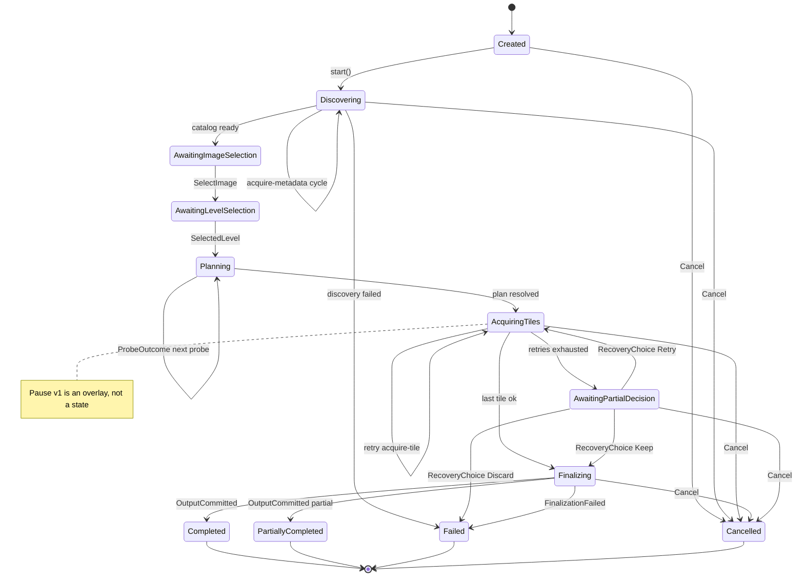

# Job engine

`dezoomify::engine` in the pure `crates/dezoomify` domain crate is the deterministic state machine behind every job. It decides what happens next; hosts do it. It never touches I/O, pixels, time, or output files. The browser runtime drives it through the WASM bridge; the native runtime drives it directly. Shared scenarios assert both runtimes behave the same.

## Model

A job holds fixed input intent plus evolving state: discovery, selection, planning, tile acquisition, outstanding effect correlation, finalization, failure, cancellation. Destinations and save progress belong to the host, not the job. Routing tokens stay outside the job.

Hosts drive the single canonical API on `EngineJob` (`crates/dezoomify/src/engine/engine_api.rs`): `start(options)` validates and enters discovery; `command(cmd)` applies user intent (select image/level, follow deferred entries, answer partial decisions, pause, resume, cancel); `complete(id, result)` settles one outstanding effect with a body-free result; `provide_metadata(id, response, bytes)` supplies one metadata body. Every answer returns an `Update` with the newly issued effects plus the current `Snapshot`. Commands can never supply bytes and never claim publication; bytes travel through `provide_metadata` and publication is reported by the host through `OutputCommitted`.

Effects carry engine-minted, job-scoped correlation (`EffectId`, one fresh ID per attempt). Hosts echo the ID back verbatim; unknown or already-settled completions are rejected with `job.stale-effect` and change nothing. The host feeds retry wakeups explicitly, so replaying the same inputs replays the same state.

Phase-specific data lives in single-discriminant groups (`Selection`, `Decision`, `Finalization`, one unified probe flight), so unrelated phases cannot represent each other's data: answering a partial decision with none pending is a single-check rejection on the decision discriminant, decided data never survives its phase exit on any answer arm, and a probe flight (continuation, wire tile, reuse flag) is set and cleared as one unit.

## Phases

Discovery, selection, planning, tile acquisition, then one awaited finalization. The engine exposes only phases it observes; codec and save progress are product-local UI events.

Selection is explicit when discovery finds several images or levels. Commands carry zero-based positions into the kept catalog. Headless callers pass a deterministic selection rule up front; the engine never guesses. `NativeAutomatic` owns native image-index clamping, same-job following when that entry is deferred, and native level precedence (exact zoom level, largest regardless of caps, largest fitting both optional caps, smallest known width fallback, then largest area by default). Browser selection retains its separate largest-ready-image and canvas-limit policy. Discovery also returns still-deferred entries (a IIIF service, a bulk-list entry) as `ImageRequest` items carrying a follow-up URI; the engine follows one within the same job (`FollowDeferred`, bounded follows, cycle-guarded, catalog replaced, no host-created replacement jobs).

## Retry and progress

The engine schedules retries; the host waits and re-requests. The website proxy transition (one proxy effect for eligible metadata after a classified direct failure or metadata-window expiry) runs before ordinary same-transport retry; see [Browser runtime](browser-runtime.md#request-order). Auth failures, bad metadata, unknown formats, and deterministic decode failures never retry.

Typed tile failures carry structured facts (stable code, HTTP status, `retry_after_ms` hint, bounded diagnostics) instead of one boolean. Permanent failures (auth refusals such as HTTP 403, other 4xx, bad metadata, deterministic decode failures, unknown codes) settle the tile after exactly one attempt. Transient failures (timeouts, network errors, rate limits, 5xx) retry up to the exact budget (`max_retries` retries after the initial attempt) with one explicit `WaitForRetry` timer effect per retry; the delay is a 1 s base doubling to a 30 s ceiling, with an observed `retry-after` honored to 300 s. The host owns the clock and reports the elapsed timer back, so the engine schedules no work from silence.

A settled-as-failed tile joins the partial decision only after acquisition settles (nothing in flight, queued, or awaiting a timer), so late successes still count and the missing list is complete with full structured detail per tile. A partial retry requeues exactly the settled-as-failed tiles in plan order with a fresh attempt budget and preserves successes.

Known grid and positioned plans validate their declared count against `max_tiles` before acquisition begins, then keep a lazy row-major/source-order cursor. Grid and positioned iterators assign dense wire ordinals in iteration order; a compact status ledger uses each ordinal directly. The cursor materializes a `TileSpec` only when an acquisition slot opens. Request URI, headers, processing recipe, destination, and extent stay with active tiles and failures that may be retried; they are released after success or when the job finalizes. Scheduling keeps O(1) status lookup and advances the source cursor once; it does not materialize every request or maintain an initial pending-ID queue. A late source-generation error follows the normal typed failure and cancellation path, including for tiles already in flight.

Progress counts work units per phase (completed, active, queued, failed, total where known). Byte counts supplement unit counts. Progress never moves backward and never claims unknown totals as complete.

## Cancel and partial output

Cancel is a command. The engine stops new work and emits one idempotent `cancel-release` instruction before reaching `cancelled`.

Partial policy, picked up front:

- `fail`: missing tiles mean no output;
- `keep`: the gappy result is encoded with missing regions marked;
- `prompt`: the job pauses and asks (typed keep/discard/retry).

Partial results list every missing tile and keep the error behind each gap. A kept partial publishes only after successful encode and finalization. Metadata, permission, destination, encoding, and publication failures never become partial success.

## Pause v1 (suspend-acquisition)

Pause is an overlay, not a state; the snapshot's `paused` flag reports it. `Pause` works in any non-terminal state (post-terminal inputs stay `job.post-terminal`); `Resume` without pause is `job.invalid-state`. Cancel wins while paused.

While paused the engine schedules no new `acquire-tile` effects, finishes in-flight work, keeps decoded output and queue order, and defers retry wakeups until resume. Tile arrivals still record progress but defer completion; exhausted retries still move to `AwaitingPartialDecision`. Probing and discovery continue (only tile acquisition suspends). `Resume` re-drives pending tiles, or completes when everything already arrived.

## Behavior table (implemented)

`dezoomify::engine` answers synchronously: every `start`/`command`/`complete`/`provide_metadata` returns an `Update` with the newly issued effects and the current `Snapshot` (job-scoped revision, lifecycle, pause flag, progress, selection/decision payload, terminal result, and output summary). The snapshot projects the inner job's read-only state; effects are the only drained queue. The revision increases once for each accepted start, user command, or host completion that applies a transition, independent of how many effects that transition issues; ignored or stale input leaves it unchanged. `Terminal` = `Completed` / `PartiallyCompleted` / `Failed` / `Cancelled`. Post-terminal inputs return stable `job.post-terminal` rejection with no work. Unknown or already-settled completions return `job.stale-effect` with no work. Wrong-kind completions (`job.wrong-result-kind`, including bytes aimed at a non-metadata effect and publication claims outside finalization) and empty metadata bodies (`job.empty-resource`) preserve the outstanding effect so the host can still answer it correctly; a rejected `OutputCommitted` never sets the output disposition.

## Host-effect contract

Effects carry everything a host needs; hosts never re-derive job policy or tile geometry. Canonical here; [Browser runtime](browser-runtime.md#engine-effect-assembly) and [Native apps](native-apps.md#native-runtime) cover host-side execution only.

- `acquire-metadata{id, uri}`: fetch one metadata resource; answer with `provide_metadata` (body) or `complete` with `MetadataFailed`.
- `acquire-tile`: effect id, engine tile id, request (URI, headers), output placement (position, planned extent, declared canvas, processing recipe, probe flag). Hosts decode during acquisition, so decode failures arrive as tile outcomes. Answer with `TileAcquired`, `TileDisplayed` (ordinary image, no readable bytes), or `TileFailed` with structured facts.
- `wait-retry-timer{id, tile, attempt, delay_ms}`: the host waits `delay_ms` on its own clock and answers with `complete(id, TimerElapsed)`; no new acquisition for the tile starts before that completion.
- `finalize-output{id, partial, canvas}`: the host validates its destination, assembles, encodes, saves or displays, and answers once with `OutputCommitted` (plus its disposition) or `OutputFailed`. Completion follows success only.
- `request-partial-decision{id, generation, missing}`: answer with `command(AnswerPartial{decision})`.
- `cancel-release{id}`: idempotent; cancel work and release kept resources after cancellation or failure.

Discovery walks ordered roots in registry order. A root with bytes is evaluated directly; a URL-only root starts with an `acquire-metadata` effect. The first root yielding a catalog wins; failures advance to the next root. One `acquire-metadata` effect per outstanding core request; the same effect stays outstanding until answered, so the engine never spins on silence.

A probe tile answered as available whose position the resolved plan reuses (`probe_output`) counts as already fetched; the host keeps the decoded probe. Other probes stay advisory and never enter retry or partial handling.

| Input | Valid source state(s) | Validation | Transition | Effects | Snapshot |
|---|---|---|---|---|---|
| `start(options)` | (no job yet) | Options valid (`max_retries` 0..=1024, 0 is first attempt only), non-empty ordered inputs with `http(s)`/`file://`/local-path URLs (≤2048B, `file://` only local absolute), known format (`None`/`auto` or registered name, else `Err(job.unknown-format)` with no transition) | `Created` -> `Discovering` | supplied root bytes are evaluated directly; otherwise `acquire-metadata` per outstanding discovery request | snapshot `Discovering` |
| `provide_metadata(id, response, bytes)` | `Discovering` | outstanding metadata effect, `bytes.len() <= max_bytes`, non-empty (empty bodies are rejected with `job.empty-resource` and change nothing) | Stay (core asks for more resources) or -> `AwaitingImageSelection` | further `acquire-metadata` or none | snapshot `Discovering`, then `AwaitingImageSelection` with the catalog |
| `provide_metadata` late (sibling fetch after a winner finished discovery) | Any non-`Discovering` with a live metadata effect | effect still outstanding | No transition (winning catalog survives) | none | none (empty answer) |
| `provide_metadata` over-limit | `Discovering` | `bytes.len() > max_bytes` | -> `Failed` | `cancel-release` | `failed:job.resource-limit` (terminal once) |
| `complete(id, MetadataFailed)` | `Discovering` | outstanding metadata effect | Core owns fallback: stay `Discovering` (other candidates' `acquire-metadata`) or -> `Failed` | `acquire-metadata` or `cancel-release` | snapshot `Discovering`, or `failed:job.discovery-failed` |
| `complete(id, MetadataFailed)` late (sibling fetch after discovery finished) | Any non-`Discovering` with a live metadata effect | effect still outstanding | No transition | none | none (empty answer) |
| `command(SelectImage{image})` | `AwaitingImageSelection` | image position in range and ready | -> `AwaitingLevelSelection` | none | snapshot `AwaitingLevelSelection` |
| `command(SelectLevel{level})` | `AwaitingLevelSelection` | level position in range for the selected image | -> `Planning` -> `AcquiringTiles` (planning settles within the answer; probe plans surface `Planning` snapshots) | `acquire-tile` up to the concurrency limit, or one probe | snapshot `AcquiringTiles`, `progress` |
| `complete(id, ProbeAvailable{width,height})` / `complete(id, ProbeMissing)` | `Planning` | outstanding probe effect; available observations need positive width/height | One core probe step: next probe (stay `Planning`) or resolved plan -> `AcquiringTiles` | `acquire-tile` (next probe or first plan tiles) | snapshot `Planning` or `AcquiringTiles`, `progress:0/total` |
| `complete(id, TileAcquired)` on a probe effect | `AcquiringTiles` | probe effects are answered with probe results only | No transition, no work | none | none (`Err(job.invalid-state)`) |
| `complete(id, TileAcquired)` / `complete(id, TileDisplayed)` | `AcquiringTiles` | outstanding tile effect | Stay or last tile -> `Finalizing` | next `acquire-tile` or one `finalize-output` | `progress`, snapshot `Finalizing` |
| `complete(id, TileFailed{failure})` | `AcquiringTiles` | outstanding tile effect | permanent (e.g. HTTP 403): settle after exactly one attempt; transient: one `wait-retry-timer` per remaining attempt; exhausted: stash as settled-as-failed; the partial decision waits until every planned tile is acquired or settled-as-failed with nothing in flight, queued, or timer-pending | `wait-retry-timer{id, tile, attempt, delay_ms}` or, once settled, `request-partial-decision` | `warning` (transient only) + `progress`, or snapshot `AwaitingPartialDecision` |
| `complete(id, TimerElapsed)` | `AcquiringTiles` | outstanding timer effect | requeue the tile and emit `acquire-tile`; unknown timers change nothing | `acquire-tile` or none (paused) | `progress` chain on resume |
| `command(AnswerPartial{Retry})` | `AwaitingPartialDecision` | decision outstanding | -> `AcquiringTiles`, requeueing exactly the settled-as-failed tiles in plan order with a fresh attempt budget; acquired tiles are preserved | `acquire-tile` | snapshot `AcquiringTiles` |
| `command(AnswerPartial{Keep})` | `AwaitingPartialDecision` | decision outstanding | -> `Finalizing` | `finalize-output{partial:true}` | snapshot `Finalizing` |
| `command(AnswerPartial{Discard})` | `AwaitingPartialDecision` | decision outstanding | -> `Failed` | `cancel-release` | `failed:job.partial-discarded` |
| `complete(id, OutputCommitted{disposition})` | `Finalizing` | outstanding finalize effect | -> `Completed` or `PartiallyCompleted` | none | exactly one terminal snapshot |
| `complete(id, OutputFailed{code,message})` | `Finalizing` | outstanding finalize effect | -> `Failed` | `cancel-release` | typed failure |
| `command(Cancel)` | Any non-terminal |  | -> `Cancelled` (settled synchronously) | exactly one idempotent `cancel-release` | terminal `cancelled` snapshot |
| `command(Pause)` | Any non-terminal |  | Overlay on (no state change) | none | snapshot `paused:true` |
| `command(Resume)` | Paused only | paused | Overlay off, re-drive pending or complete | `acquire-tile` (pending) or `finalize-output` when all arrived paused | snapshot `paused:false`, then `progress` chain |
| `complete(id, TileAcquired)` while paused | `AcquiringTiles` + paused | outstanding tile effect | Stay (no new scheduling, completion deferred) | none | `progress:a/total` only |
| Duplicate/stale | Same state, already-settled effect | Correlation already settled | No transition | none | none (empty answer for live jobs) |
| Wrong-state / unknown correlation / post-terminal | Any | never-issued effect, invalid state, resume-without-pause, or terminal set | No transition, no work | none | none (`Err(job.invalid-state | job.stale-effect | job.post-terminal)`) |
