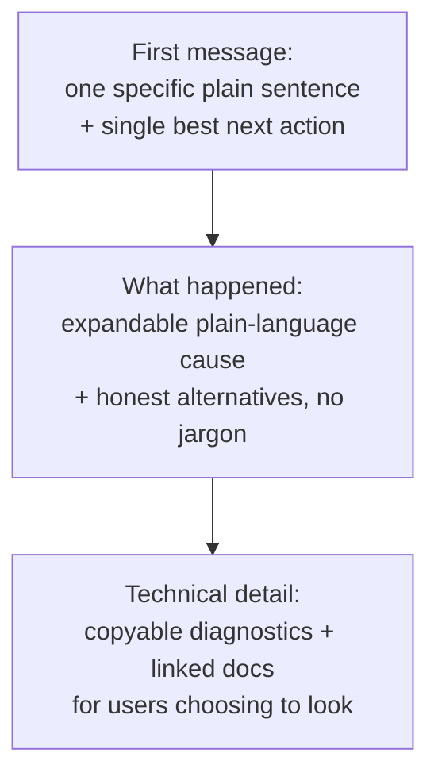

# Product

dezoomify turns tiled, zoomable images into portable files. A user supplies a URL, picks a discovered image and level, reviews output constraints, and runs a job with live progress, cancellation, retry, and an explicit partial-output choice.

## Apps

- **Website**: common public sources, no install. Uses the [browser transport policy](browser-runtime.md#request-order); shows the active transport; no per-attempt prompts. Ordinary tiles without readable bytes stay visible as a tainted canvas with no programmatic save.
- **Browser extension**: finds viewers in the open page; fetches with the browser session under granted permissions; see [Extension](extension.md).
- **Desktop app**: native runtime for large images and local sources, one file or `iiif-dir` per job; see [Native apps](native-apps.md).
- **CLI**: same native behavior for scripts; see the [Command-line guide](user/command-line.md).

One React TSX shared UI presents the same job concepts in every app. Capability negotiation changes available actions, never their meaning. See [Architecture](architecture.md) and [Protocol](protocol.md).

## Choosing an app

Users pick an app under time pressure and without background knowledge. Every app explains the choice honestly:

- Actions and outcomes, never mechanism words. User copy avoids network policies, headers, permission APIs, transport names.
- Limits read as facts about the app, never as faults of site or user. Example: "this website shows the image but saves no copy because the site serves it only to its own pages; the browser extension saves it with your approval for that site."
- The comparison renders from the same negotiated capabilities the app runs on. An app never recommends what it fails to verify as available, and never rules out what it fails to verify as unavailable.
- The same guidance appears in docs and in every app; wording adapts to context, substance never changes.

This page speaks to implementers; user copy derived from it keeps the plain-language rules above.

## Progressive disclosure

Users get the minimum first:

1. **First message:** one specific plain sentence (what happened in this job) plus the single best next action.
2. **"What happened":** expandable plain-language cause plus honest alternatives, still no jargon.
3. **Technical detail:** copyable diagnostics and linked docs, for users choosing to look.

Nothing important hides in an unreachable tier, and every failure leaves at least one next action. Structured context is captured at error time (code, phase, transport, kind, blocked reason, redacted origin, capability snapshot), so messages and reports stay specific without interrogating the user. See [Errors](errors.md#user-presentation).

## Core workflow

1. The runtime discovers one or more image catalogs from an input.
2. The user selects an image, resolution level, processing recipe, and output.
3. The job engine validates the request against runtime capabilities.
4. The runtime executes tile acquisition and processing effects while the engine records their outcomes and reports deterministic progress.
5. The engine drives encoding, finalization, publication, and cleanup effects through the selected output destination.

Discovery, selection, acquisition, processing, and saving stay distinct, keeping failures and recovery choices specific; see [Job engine](job-engine.md) and [Errors](errors.md).

## App boundaries

Browsers handle interactive jobs fitting browser memory and save limits; budgets: [Compatibility](compatibility.md#canvas-and-save-limits). Native apps own huge images and local input (PNG, JPEG, TIFF, ZIF, WebP, file or `iiif-dir`). Website baseline: encoders `[png]`; native baseline: [Native apps](native-apps.md#capability-baseline). Queues live in the integration layer, never the engine: website single-queue (submitted addresses wait their turn), desktop multi-job queue (table with per-job progress, cancel one/all, retry failed). CLI `--bulk` runs one bounded run per entry with shared per-entry plus totals reporting. Credentials: [Security](security.md).

dezoomify bypasses no authentication or access controls. Users are responsible for permission to retrieve and reproduce source material.
