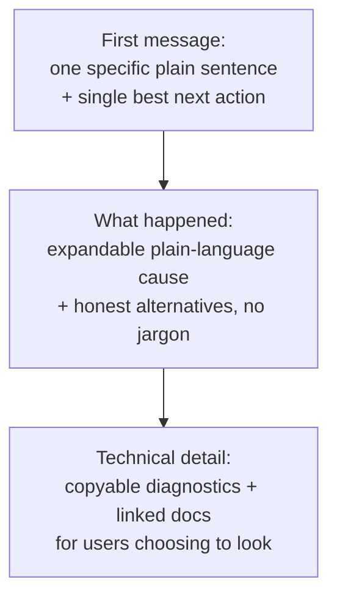

# Product

dezoomify turns tiled, zoomable images into portable files. A user supplies a URL, picks a discovered image and level, reviews output constraints, and runs a job with live progress, cancellation, retry, and an explicit partial-output choice.

## Apps

- **Website**: common public sources, no install. Uses the [browser transport policy](browser-runtime.md#request-order); shows the active transport; no per-attempt prompts. Ordinary tiles without readable bytes stay visible as a tainted canvas with no programmatic save.
- **Browser extension**: finds viewers in the open page; fetches with the browser session under granted permissions; see [Extension](extension.md).
- **Desktop app**: native runtime for large images and local sources, one file or `iiif-dir` per job; see [Native apps](native-apps.md).
- **CLI**: same native behavior for scripts; see the [Command-line guide](user/command-line.md).

One React TSX shared UI presents the same job concepts in the graphical apps. Each product supplies the actions its Host supports. See [Architecture](architecture.md) and [Bindings](bindings.md).

## Choosing an app

Users pick an app under time pressure and without background knowledge. Every app explains the choice honestly:

- Actions and outcomes, never mechanism words. User copy avoids network policies, headers, permission APIs, transport names.
- Limits read as facts about the app, never as faults of site or user. Example: "this website shows the image but saves no copy because the site serves it only to its own pages; the browser extension saves it with your approval for that site."
- The comparison describes each product's implemented capabilities and limits. An app offers only actions its Host supports.
- The same guidance appears in docs and in every app; wording adapts to context, substance never changes.

This page speaks to implementers; user copy derived from it keeps the plain-language rules above.

## Progressive disclosure

Users get the minimum first:

```mermaid
flowchart TD
    F[First message:<br/>one specific plain sentence<br/>+ single best next action] --> W[What happened:<br/>expandable plain-language cause<br/>+ honest alternatives, no jargon]
    W --> T[Technical detail:<br/>copyable diagnostics + linked docs<br/>for users choosing to look]
```

1. **First message:** one specific plain sentence (what happened in this job) plus the single best next action.
2. **"What happened":** expandable plain-language cause plus honest alternatives, still no jargon.
3. **Technical detail:** copyable diagnostics and linked docs, for users choosing to look.

Nothing important hides in an unreachable tier, and every failure leaves at least one next action. Structured context is captured at error time (code, phase, transport, kind, blocked reason, and source origin), so messages and reports stay specific without interrogating the user. See [Errors](errors.md#user-presentation).

## Core workflow

1. The product supplies input, settings, and a Host to the Rust algorithm.
2. The algorithm validates input and discovers image catalogs.
3. The algorithm selects an image and level according to settings, awaiting a Host choice when interactive selection is requested. Formats determine tile processing.
4. The algorithm awaits bounded tile acquisition through Host capabilities and reports progress.
5. The algorithm awaits Host output and cleanup, returning the actual result.

Discovery, selection, acquisition, processing, and saving stay distinct, keeping failures and recovery choices specific; see [Algorithm](algorithm.md) and [Errors](errors.md).

## App boundaries

Browsers save PNG for jobs fitting browser memory and save limits; budgets: [Compatibility](compatibility.md#canvas-and-save-limits). Native apps support large images and local input, with [six output formats](native-apps.md#output-naming-and-encoders): native encoders `[png, jpeg, tiff, zif, webp]` plus `iiif-dir` output. Queues belong to the application: website submitted addresses wait their turn, desktop shows per-job progress with cancel one/all and retry failed. CLI `--bulk` runs one bounded invocation per entry with per-entry results and totals. Credentials: [Security](security.md).

dezoomify bypasses no authentication or access controls. Users are responsible for permission to retrieve and reproduce source material.
