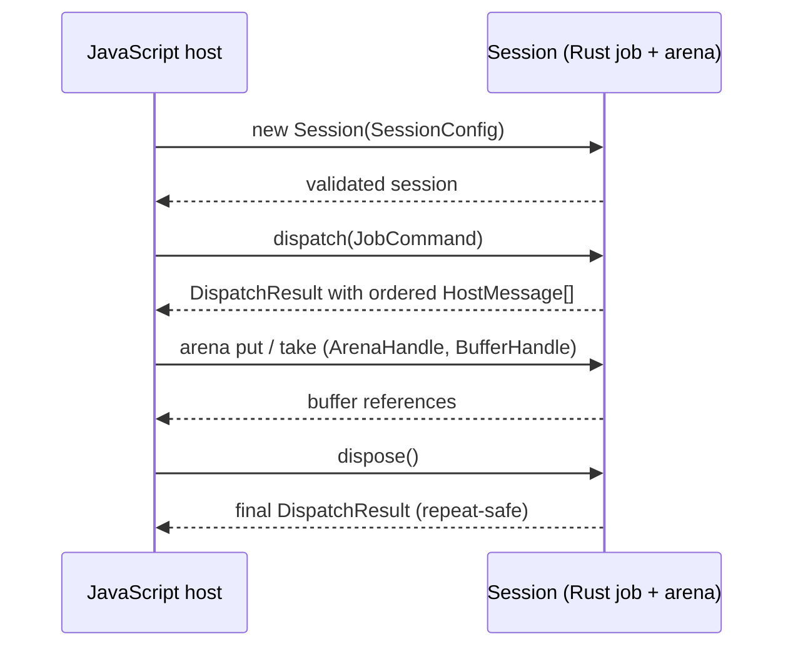
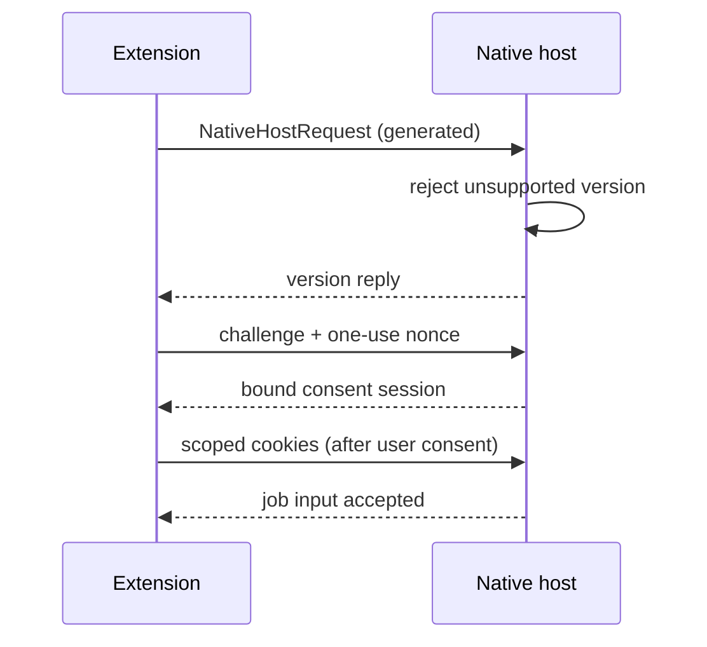

# Cross-language contracts

`crates/dezoomify-protocol` is the single source of truth for types crossing the Rust/TypeScript line. Its Rust definitions derive `Serialize`, `Deserialize`, and `Tsify`. The real `wasm-bindgen` declaration is tracked in `packages/wasm-bindings` and imported by every TypeScript boundary.

`cargo xtask protocol generate` rebuilds that declaration. Its `--check` form rebuilds in a temporary directory and compares byte-for-byte. TypeScript compilation against the declaration is part of `cargo xtask check`.

## WASM session ABI

One JavaScript `Session` owns one Rust job and byte arena:

- `new Session(SessionConfig)` validates typed quotas;
- `dispatch(JobCommand)` returns a `DispatchResult` immediately;
- a successful result contains ordered `HostMessage[]` values;
- `dispose()` returns its final `DispatchResult` and is repeat-safe;
- arena methods exchange generated `ArenaHandle` and `BufferHandle` objects.

Commands, effects, events, config, errors, URLs, and handles cross as plain JavaScript objects (fallible `tsify`/`serde-wasm-bindgen` conversion). Binary bodies stay in the bounded WASM arena. Fixed vocabularies (processing recipes, output formats) are generated string unions, never free text. Present probe observations carry non-zero dimensions; a missing observation is its own union variant.

## Commands, effects, and events

`JobCommand` carries user intent or answers one correlated effect. `Start` carries ordered discovery roots. Answers carry a job-scoped request number plus a buffer reference or `FetchFailureDto`. Image/level choices are zero-based catalog positions. Recovery choices carry the outstanding decision generation. Deferred metadata travels as `ImageRequest` entries with a follow-up URI for a fresh bounded job.

`HostEffect` (resource/tile/probe acquisition, finalization, cancellation, recovery decisions) and `JobEvent` (state, catalog, progress, warnings, recovery, terminal outcomes) are both exhaustive; boundaries handle them through typed tables. Effect meanings are in the [host-effect contract](job-engine.md#host-effect-contract).

## Errors

`ErrorDto`: stable code, phase, retryability, user message, recovery actions, plus optional request URI, transport, resource kind, blocked reason, HTTP status, bounded server signal, diagnostics. Browser fetch failures cross as `FetchFailureDto` (host-observed facts only); the Rust session adds the correlated request's phase, URI, and kind, so classifiers omit and invent nothing. See [Errors and recovery](errors.md).

Adapter faults (bad external input, session misuse) travel the separate `DispatchResult` error branch and never replace a job failure.

## Native Messaging version check

The independently installed extension and desktop app perform an explicit version check.

`NativeHostRequest` is generated from Rust; the native host rejects unsupported versions without translating schemas. Browser allowlisting authenticates the extension sender. Challenge plus one-use nonce bind one consented handoff and block replay. Website and deep-link handoffs are product inputs, not session ABI: validated as untrusted URLs. See [Extension](extension.md#native-handoff) and [Security](security.md).

## Product capabilities

The website baseline reports encoders `[png, jpeg, tiff]`. Values belong to product integrations; the engine still validates requested work. Native baselines: [Native apps](native-apps.md#capability-baseline). Canvas budgets: [Compatibility](compatibility.md#canvas-and-save-limits).

## Handoff

Handoff moves a job to another app via a bounded, secret-free `dezoomify://` link or allowlisted Native Messaging with explicit consent. Receivers treat handoff input as untrusted and confirm with the user before acting. Only the extension-to-native channel carries scoped cookies, and only after consent naming origins, scope, recipient, and job.
