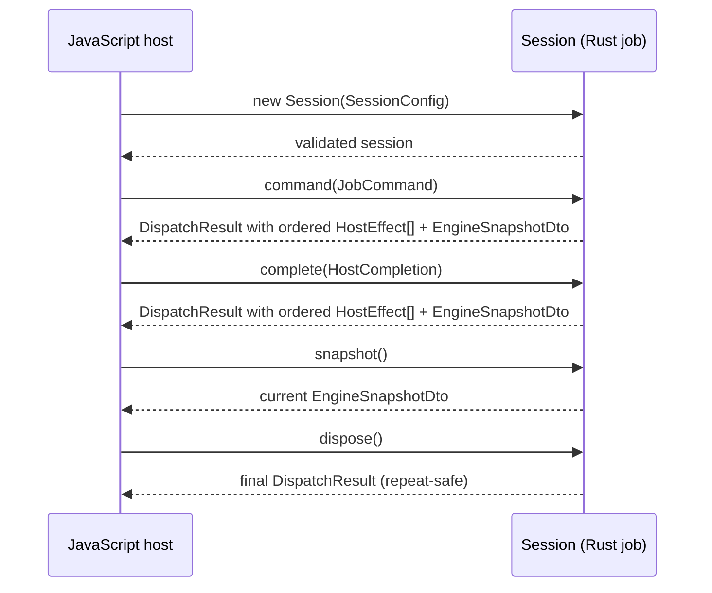
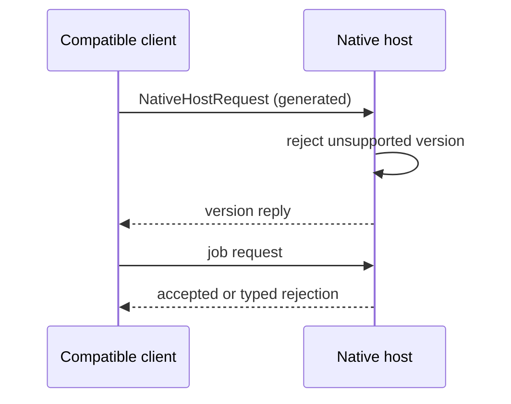

# Cross-language contracts

`crates/dezoomify-protocol` is the single source of truth for types crossing the Rust/TypeScript line. Its Rust definitions derive `Serialize`, `Deserialize`, and `Tsify`. The real `wasm-bindgen` declaration is tracked in `packages/wasm-bindings` and imported by every TypeScript boundary.

`cargo xtask protocol generate` rebuilds that declaration. Its `--check` form rebuilds in a temporary directory and compares byte-for-byte. TypeScript compilation against the declaration is part of `cargo xtask check`.

## WASM session ABI

One JavaScript `Session` owns one Rust job. Metadata bodies pass directly to the engine; tile success carries no body.

- `new Session(SessionConfig)` validates typed quotas;
- `command(JobCommand)` sends user intent and returns a `DispatchResult` immediately;
- `complete(HostCompletion)` answers a host effect and returns a `DispatchResult`;
- a successful result contains ordered `HostEffect[]` values plus the
  absolute `EngineSnapshotDto` after the answer;
- `snapshot()` returns the current `EngineSnapshotDto` without dispatching;
- `dispose()` returns its final `DispatchResult` and is repeat-safe;

Commands, effects, events, config, errors, URLs, and handles cross as plain JavaScript objects (fallible `tsify`/`serde-wasm-bindgen` conversion). Metadata bodies cross inside host completions; processing bodies use `applyProcessing`; engine quotas bound retained bytes. Fixed vocabularies (processing recipes, output formats) are generated string unions, never free text. Present probe observations carry non-zero dimensions; a missing observation is its own union variant.

## Commands, effects, and snapshots

`JobCommand` carries user intent only: `Start` carries ordered discovery roots; image/level choices are zero-based catalog positions; deferred metadata travels as `ImageRequest` entries with a follow-up URI the host follows within the same job through `follow-deferred{image}` (bounded follows, cycle-guarded, catalog replaced, no host-created replacement jobs); partial answers cross as `answer-partial{generation, decision}` with the engine `AnswerPartial` vocabulary, and stale generations are rejected rather than consumed in order. `HostCompletion` answers one correlated effect: bytes, failures, observations, and publication claims cross only here. Discovery failure context travels through the engine `note_metadata_failure` retention; the adapter retains nothing and the engine clears the retention on a winning catalog. The split is structural: the session routes user commands to the engine `command` entry point and completions to `complete`/`provide_metadata`, so user commands never supply bytes and never claim publication; bytes travel through `provide_metadata` and publication is reported by the host through the finalize completion. A host-reported `RetryTimerElapsed{effect}` answers the exact outstanding `wait-retry-timer` effect. Finalization success and failure likewise echo `effect`. The session forwards those engine-minted IDs without maintaining timer or finalization correlation tables; stale, duplicate, and wrong-kind answers are rejected without consuming a live effect.

`HostEffect` (resource/tile/probe acquisition, finalization, cancellation, recovery decisions) is exhaustive; boundaries handle it through typed tables. Job state crosses as absolute `EngineSnapshotDto` projections, never as event walks. Effect meanings are in the [host-effect contract](job-engine.md#host-effect-contract). The retry timer effect is `wait-retry-timer{effect, tile, attempt, delay_ms}`: the host waits `delay_ms` on its own clock and then answers with the matching `RetryTimerElapsed{effect}`. The engine parks ready retries while paused; the host only waits and reports completion. Tile failures cross as `TileFailureDto{code, category, http, retry_after_ms, detail}` with bounded diagnostics; `FetchFailureDto` carries the host-observed `retry_after_ms` when the response carries one. The engine backoff is a 1 s base doubling to a 30 s ceiling, with an observed `retry-after` honored to 300 s. Tile acquisition carries `TilePlacementDto{position, expected_size, canvas, processing, probe_output}` so hosts assemble without re-deriving geometry. The format grid includes `second_canvas`.

## Errors

`ErrorDto`: stable code, phase, retryability, user message, recovery actions, plus optional request URI, transport, resource kind, blocked reason, HTTP status, bounded server signal, diagnostics. Browser fetch failures cross as `FetchFailureDto` with a generated `FetchFailureCode`; the Rust session adds the correlated request's phase, URI, and resource kind, so classifiers omit and invent nothing. The fetch code replaces the untyped fetch-code string and preserves its stable wire values. See [Errors and recovery](errors.md).

Adapter faults (bad external input, session misuse) travel the separate `DispatchResult` error branch and never replace a job failure.

## Native Messaging version check

The standalone Native Messaging host checks protocol versions with compatible clients. The shipped browser extension does not contain a Native Messaging client and does not request the `nativeMessaging` or `cookies` permissions.

`NativeHostRequest` is generated from Rust; the native host rejects unsupported versions without translating schemas. Browser allowlisting authenticates a compatible browser sender. Website and deep-link handoffs are product inputs, not session ABI: the native app validates raw URLs as untrusted input. The current extension uses the ordinary deep-link route where offered and does not send browser cookies or auth headers to the native host. See [Native apps](native-apps.md) and [Security](security.md).

## Product capabilities

The website baseline reports encoders `[png]`. Values belong to product integrations; the engine still validates requested work. Native baselines: [Native apps](native-apps.md#capability-baseline). Canvas budgets: [Compatibility](compatibility.md#canvas-and-save-limits).

## Handoff

Handoff moves a job to another app via a `dezoomify://` link or the standalone Native Messaging protocol. Receivers treat handoff input as untrusted and confirm deep-link input with the user before acting. Native Messaging clients provide their own authentication and consent policy; the shipped extension has no Native Messaging client.
