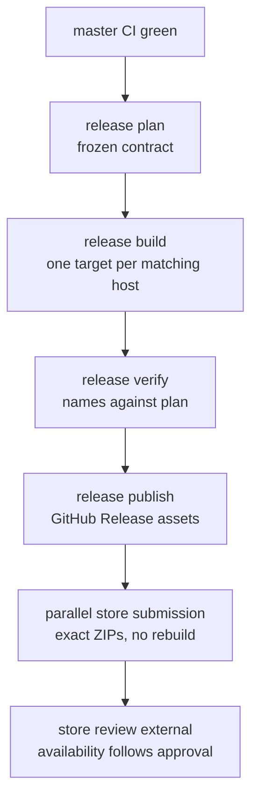

# Releases

One version covers core libraries, generated bindings, website, extension, CLI, and desktop artifacts, plus the Native Messaging range for the standalone host and compatible clients.

## Versioning

One version names a tested source revision across all apps. `cargo xtask release version` derives it from Git: `vX.Y.Z` is `X.Y.Z`; each following first-parent commit bumps `Z`. Manifests author no versions; builds receive the derived value as `DEZOOMIFY_VERSION`. The Native Messaging host version range is independent of app versions because the host and compatible clients may be installed separately. WASM bindings ship with their browser product from the same revision and version nothing on their own.

## Compatibility

The standalone Native Messaging host runs the [version check](protocol.md#native-messaging-version-check) with compatible clients. An out-of-range peer stops safely. Deep-link input carries its app version; receivers reject unsupported or expired data before confirmation or effects. The shipped extension does not send credentials through Native Messaging.

## Release gates

A release candidate passes:

- full Rust and TypeScript formatting, lint, and unit suites;
- Rust-source-to-TypeScript binding generation checks and clean-tree checks;
- shared scenarios on native, WASM, shared UI, extension, Tauri, and CLI targets;
- supported browser and operating-system smoke tests;
- Native Messaging version rejection, event-gap, and handoff fixtures;
- encoder output and large-image boundary tests;
- website direct-first request-order and classified automatic proxy-fallback tests;
- proxy public-resource eligibility, credential omission, redirect, and active-transport display audits;
- extension permission, Native Messaging sender-authentication, redaction, and dependency audits.

## Pipeline

`cargo xtask release plan|build|sign|verify|publish` is the only release orchestration; each stage validates the previous stage's digests and fails closed on missing inputs, tools, or secrets. The plan freezes a deterministic contract (version, tag, commit, Messaging range, capabilities, targets) from Git, `release/config.toml`, `release/targets.toml`, the Messaging support range, and `generated/release-capabilities.json`. Every planned target builds on its matching host; all are mandatory. Verify checks artifact names against the plan. Publish verifies again and refuses unless `origin/master` is the planned revision. Descriptions use the annotated tag message, or commit titles since the preceding tag. Rolling releases use `rolling-v<version>` and become GitHub's latest; important numbered releases use `vX.Y.Z`. Working trees under `target/release-dist/<version>/` are never committed (under `target/` so website builds never clobber them).

The `release` workflow runs after green `master` CI and accepts dispatch with a numbered tag for an important release. Every job pins the same revision. After GitHub Release assets publish, parallel Chromium and Firefox store jobs submit the exact ZIPs from that release (Chromium uploads and publishes; AMO takes a listed-channel upload). Release artifacts are the single source of truth; store jobs rebuild nothing and check the transferred ZIP with `unzip -t` only. Store review stays external: submission is automatic, availability waits for store approval. Unsigned Linux x86_64 `.deb`, Windows x86_64 `.msi`, and Apple silicon `.dmg` build on matching GitHub-hosted runners (Windows: WebView2, WiX, NSIS, `icon.ico`; macOS: Xcode Command Line Tools, `icon.icns`). Missing prerequisites fail the release. Operator steps: [Operations](operations.md#release-runbook).

GitHub Releases holds provenance and the exact store-submitted artifacts. Installers stay unsigned. User note: [Desktop app guide](user/desktop-app.md#install).

## Desktop updater

Automatic in-app updates are disabled: no update host is deployed and no updater key exists. Users install the [latest release](https://github.com/lovasoa/dezoomify/releases/latest) manually. The shipped desktop capability sets `updater.enabled: false` with an empty allowlist, `tauri.conf.json` ships empty endpoints, `release/config.toml` sets `[updater] enabled = false` with empty endpoints and no key file, and empty `UPDATER_PUBKEY` keeps the plugin failing closed.

`apps/desktop/src-tauri/src/updater.rs` keeps a tested `validate_candidate` describing the policy a future self-hosted updater enforces (strict ed25519 over `dezoomify-updater-v1`, HTTPS allowlist, 7-day stale bound, +300 s future skew, anti-rollback, explicit user confirmation, never auto-stage); production `validate_update` rejects everything with `updater.disabled` and the installed app keeps working. The capability grants only `updater:allow-check`, so download and install stay denied. Activation needs an undone key ceremony: a real pubkey replacing empty `UPDATER_PUBKEY` (also registering the plugin via the `tauri_shell.rs` gate), deployed endpoints, `enabled = true`. Until then no host or key is invented and every candidate fails closed.

See [Testing](testing.md) for test structure and [Security](security.md) for trust requirements.
